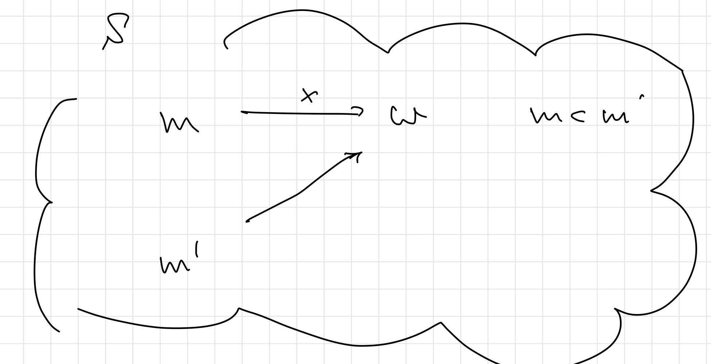

# 1.1 最初の問題：安定マッチング

## 問題1.1 安定マッチング（Stable Matching）：問題の背景と定式化

> グラフ理論において**マッチング**とは、グラフ中の枝集合で、互いに端点を共有しないもののこと。（中略）また、グラフ上の全ての頂点が、マッチング中のいずれかの枝の端点になっているとき、そのマッチングを**完全マッチング**という。 <https://en.wikipedia.org/wiki/Matching_(graph_theory)>

### 問題の定式化

- $n$ 人の男性の集合を $M=\{m_1,\ldots,m_n\}$, $n$ 人の女性の集合を $\{w_1\ldots,w_n\}$ とする
- $m\in M$ と $w\in W$ からなる順序対 $(m,w)$ のすべての集合を $M\times W$ と書く
- $M\times W$ の部分集合 $S,S'$ に対して、 $M$ のどの男性と $W$ のどの女性に対しても、
  - その人を含む $S$ の順序対が高々１個であるとき、 $S$ は**マッチング**（matching）と呼ばれる
  - その人を含む $S'$ の順序対がちょうど１個であるとき、**完全マッチング**（perfect matching）と呼ぶ
- 各男性 $m\in M$、各女性 $w\in W$ はそれぞれ全女性、男性に対する**好意順リスト**（preference list）を持つ
  - 高いランクをつけることはより好きであることを意味
- 今 $S$ 内に２つのペア $(m,w), (m',w')$ があり、 $m$ が $w$ より $w'$ が好きで、 $w'$ が $m'$ より $m$ が好きであるとき $(m,w')$ を $S$ に対する**不安定性**（instability）と呼ぶ
- マッチング $\mathcal{S}$ は、完全であり、 $\mathcal{S}$ に関する不安定性が存在しないとき、**安定**（stable）であると呼ばれる

## アルゴリズム1.1 安定マッチングアルゴリズム（Stable Matching Algorithm）

### Gale-Shapley(G-S) アルゴリズム

> **注意**
> 自由な男性の選び方は定められていない

## アルゴリズムの解析

アルゴリズムによって得られるマッチングが完全かつ安定なマッチングであることを示す。

### (1.1) 女性 $w$ は最初にプロポーズされた後は（相手が変わるかもしれないが）ずっと婚約状態である。さらに、後から婚約する男性ほどより好きな男性になる

### (1.2) 男性 $m$ がプロポーズする女性は好きな度合いが徐々に下がっていく

### (1.3) G-S アルゴリズムは While ループを高々 $n^2$ 回反復して終了する

証明

> 反復 $t$ の終了時までに、 $m$ が $w$ にプロポーズしたペア $(m,w)$ のすべての集合を $P(t)$ とする。すべての $t$ で $P(t+1)$ のサイズは $P(t)$ のサイズより真に大きくなる。しかし、男性と女性のペアのサイズは高々 $n^2$ であるので、アルゴリズム全体で $P(*)$ は高々 $n^2$ 回しか増加できない。

### (1.4) アルゴリズムの実行中のある時点で、男性 $m$ が自由の身ならば、まだ $m$ がプロポーズしていない女性がいる

証明

> $m$ が自由な身にあるにもかかわらず、全ての女性にプロポーズしてしまっているという時点が存在したと仮定する。すると、(1.1) により、この時点で $n$ 人の女性はいずれも婚約中ということになる。これは自由な身の男性がいる状況に矛盾する

### (1.5) アルゴリズムの終了時に返される $S$ は完全なマッチングである

証明

> 自由な身の男性がいる限りアルゴリズムは終了しない。仮にすべての女性にプロポーズした自由の身の男性がいたとしても、これは(1.4)に反する。

### (1.6) $S$ を G-S アルゴリズムの一つの実行で返されるペアの集合とする。すると、$S$ は安定マッチングである

証明

> $S$ に関する不安定性のペア $(m,w),(m',w')(m:w&ltw',w':m'&ltm)$ の存在を仮定する。
>
> 最終的に $(m,w)\in S$ であることから、$m$ の最後のプロポーズは $w$ に向けられたものである。ここで、それ以前に $m$ が $w'$ にプロポーズしていなかった場合とそうでない場合を考える。
>
> まず、プロポーズしていなかった場合、これは好意順リスト $(m: w&ltw')$ の仮定に反する（先に $w$ がプロポーズされているということは、 $(m: w'&ltw)$）。
>
> 対して、 $m$ から $w$ へのプロポーズ以前に、 $m$ が $w'$ にプロポーズしていた場合、 $w'$ は $m$ より好きな男性 $m''$ と婚約して、最終的に $m$ からのプロポーズを断ったことになる。最終的な $w'$ のパートナーは $m'$ であるから、$m'=m''$ か $w: m'&ltm''$ のいずれかが成り立つ。しかしいずれも $w': m'&ltm$ に反する。
>
> 

---

- G-S アルゴリズムには不公平性（unfairness）が介在
  
- 男性の選び方によってアルゴリズムの出力は変化するか？

各男性 $m$ に対して、ペア $(m,w)$ を含む安定マッチングが存在するとき、 $w$ は $m$ の**正当なパートナー**（valid partner）であるといい、 $w$ が $m$ の正当なパートナーでありかつ $w$ よりも好きなどの女性も $m$ の正当なパートナーでないとき、 $w$ は $m$ の**最善の正当なパートナー**（best valid partner）であるという

$m$ の最善の正当なパートナーを $best(m)$ と書き、 $\{(m, best(m)) : m\in M \}$ を $S^*$ と表す

### (1.7) G-S アルゴリズムのどの実行でも、集合 $S^*$ が得られる

証明

> G-S アルゴリズムのある実行 $\epsilon$ で、ある男性が最善の正当なパートナーでない女性とペアになっている安定マッチング $S$ が得られたと仮定する。
>
> 特に $\epsilon$ 内で初めてある男性 $m$ が正当なパートナー $w$ に断られた状況を考える。
>
> $m$ にとっての $w$ は最善の正当なパートナー $best(m)$ となる。この時点で $w$ は $m$ より好きなある男性 $m'$ と婚約中となる。
>
> 
>
> $w$ は $m$ の正当なパートナーであったから、ペア $(m,w)$ を含む安定マッチング $S'$ は別に存在する。 $S'$ での $m'$ ペアを $w'$ と定める。
>
> $w$ から $m$ への断りは、 $\epsilon$ 内での最初の正当なパートナーからの断りであったから、 $m'$ は $w$ と婚約する時点まで、正当なパートナーからは断られていない。 $m'$ は好きな順にプロポーズしていて、さらに $w'$ は明らかに $m'$ の正当なパートナーであるので、 $m'$ は $w'$ より $w$ が好きということになる。一方で $w$ も $m$ より $m'$ の方が好みだったことから、 $(m',w)$ が $S'$ に対する不安定性となっていることが分かる。
>
> 

---

- 女性 $w$ に対して、ペア $(m,w)$ を含む安定マッチングが存在するとき、$m$ は $w$ の正当なパートナーであるという
- かつ $m$ より嫌いな（好きでない） $w$ の正当なパートナーが存在しないとき、 $m$ は $w$ の**最悪な正当なパートナー**（worst valid partner）であるということにする

### (1.8) 安定マッチング $S^*$ において、女性は最悪の正当な男性とペアになっている

証明

> $m$ が $w$ の最悪の正当な男性でないようなペア $(m,w)$ が $S^*$ に存在したと仮定する
>
> 
>
> すると、$w$ が $m$ より嫌いな男性 $m'$ とペアになっている安定マッチング $S'$ が存在する。
>
> 
>
> $w$ は $m$ の最善の正当なパートナーであり、 $w'$ が $m$ の正当なパートナーであるので( $S^*$ の定義より)、 $m$ は $w'$ より$w$ が好きであることがわかる
>
> $(m, w)$ が $S'$ に対する不安定性となり、仮定に矛盾する。
>

## まとめ

任意の入力に対して、G-S アルゴリズムは、プロポーズする側に対しては、実現できる最善の安定マッチングを、プロポーズを受ける側に対しては実現できる最悪の安定マッチングをもたらす。
