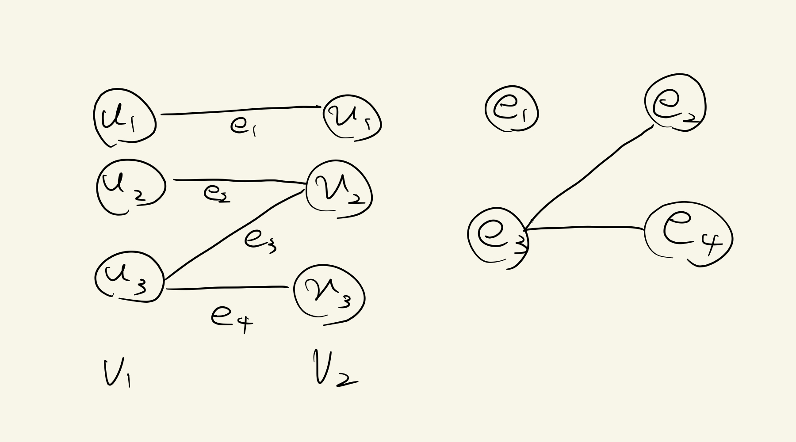

# 1.2 五つの代表的な問題

## introduction

多くの問題において, アルゴリズム設計のプロセスは以下のいくつかの重要なステップから構成される.

1. 数学的に定式化する
1. アルゴリズムを設計する
1. アルゴリズムの正当性を証明と効率性を確立

### _Def_ (グラフ)

> 点(node)の集合 $V$ と 2 点を結ぶ辺(edge)の集合 $E$ の順序対 $G = (V, E)$
> をグラフと呼ぶ.

## 問題 1.2 区間スケジューリング(Interval Scheduling)

各時刻で高々一人しか利用できない資源に対して, 時刻 $s$ から時刻 $f$ まで資源を使用したい要求が複数ある. そのような要求が勝ち亜あわないようにできるだけ多くの要求を許可したい.

#### e.g. シャワールームやトレーニングルームの使用

区間スケジューリング問題(Interval Scheduling Problem)は以下のように定式化される.

### 区間スケジューリング問題

> 入力: $(s_1, f_1),...,(s_n, f_n)$ ; $(s_i, f_i)$ : 要求, $s_i < j_i,\ \ i = 1,...,n$  
> 出力: サイズが最大の共存可能な部分集合

#### Rem: 正しくは, $(s_i, f_i)$ は要求 $i$ に付随する開始時刻と終了時刻であるが, $(s_i, f_i)$ を 要求 $i$ と同一視して, 単純に $(s_i, f_i)$ と表すことにする. 以降も同様.

### _Def_ (共存可能)

> 二つの要求 $i$ と $j$ が共存可能であるとは, $f_i \leq s_j$ または $f_j \leq s_i$ であること.  
> また, 要求の部分集合 $A$ について,${}^\forall i, j \in A$ が共存可能であるとき, $A$ は共存可能であると言う.

この問題は要求集合をあるヒューリスティックに基づいて並べ, 貪欲に処理していくことで解くことができる. このアルゴリズムはグリーディアルゴリズム(greedy algorithm, 貪欲法)と呼ばれるアルゴリズムの典型例である.

## 問題 1.3 重み付き区間スケジューリング(Weighted Interval Scheduling)

区間スケジューリング問題では共存可能な要求の個数を最大化することが目的だった. 対して, 重み付き区間スケジューリング問題では, 各要求 $i$ に $v_i > 0$ の価値あるいは重みが付随しており, その合計を最大化することを考える. 特に, 全ての区間の勝ちが等しいとき, 区間スケジューリング問題と同値である.

重み付き区間スケジューリング問題(Weighted Interval Scheduling Problem)は以下のように定式化される

### 重み付き区間スケジューリング

> 入力: $(s_1, f_1, v_1),...,(s_n, f_n, v_n)$ : 要求, $s_i < j_i, v_i > 0,\ \ i = 1,...,n$  
> 出力: $\Sigma_{i \in A} v_i$が最大となる共存可能な要求部分集合 $A$

この問題は貪欲法では解くことができず, 動的計画法(dynamic programming)を用いて解決される.

## 問題 1.4 二部グラフのマッチング(Bipartite Matching)

### _Def_ (二部グラフ)

> $G = (V, E)$ : グラフ  
> $V$ が $v_1$ と $v_2$ に分割され, $E \subseteq V_1 \times V_2$ であるとき, G を 二部グラフと呼び, $G = (V_1, V_2, E)$ とかく.

男女の集合を $V$ の分割とみると, 対応するグラフ $G = (V, E)$ が 二部グラフとなる.
各点が $M$ の高々一個の辺に含まれるような辺の部分集合 $M \subseteq E$ が $G$ のマッチングである. さらに, 各点がちょうど一個の辺に含まれるとき, M は完全マッチングである.

二部グラフのマッチング問題(Bipartite Matching Problem)は以下のように定式化される.

### 二部グラフのマッチング問題

> 入力: $G = (X, Y, E)$ : 二部グラフ  
> 出力: サイズが最大のマッチング

$|X| = |Y| = n$ のとき, サイズ $n$ の完全マッチングが存在し, そうでないときは, 完全マッチングは存在しない.  
この問題は, 増加操作(argumentation)と呼ばれる, 部分的にバックトラックしながら反復を繰り返して, マッチングのサイズを次第に大きくしていく方法で解くことができる. これは, ネットワークフロー問題(network flow problem)と呼ばれる, より大きなクラスの問題を効率的に解くための中心的な構成要素になっている.

## 1.5 独立集合(Independent Set)

### _Def_ (独立集合)

> $G = (V, E)$ : グラフ  
> $S \subseteq V$ について, ${}^\forall u,v \in S: (u, v) \notin E$ であるとき, $S$ は独立集合(independent set)あるいは独立(independent)であるという.

独立集合問題(Independent Set Problem)は以下のように定式化される.

### 独立集合問題

> 入力: $G = (V, E)$ : グラフ  
> 出力: 最大の $G$ の独立集合

独立集合問題は, ある対象物の集合とそれらの対象物のいくつかの対に互いに競合(conflict)があるとき, その中から競合のない必要なものを選ぶ問題などを符号化した問題とであると言える.

#### e.g. ディナーの招待で仲の悪い人をバッティングさせないようにする

区間スケジューリング問題と二部グラフマッチング問題は, 独立集合問題の特殊な場合である.  
区間スケジューリングでは, 区間を点として, 交差する区間に対応する二点間に辺を持つとすると, $G = (V, E)$ が定義される.  
二部グラフマッチングでは, 二部グラフ $G' = (V', E')$ に対して, $E'$ の辺を点と見る. そこで, 端点を共有する辺に対応する二点間に辺を持つとすると, グラフが定義される.  
これらのグラフはともに競合グラフと呼ばれることもある.

この問題は **NP**-完全(NP-complete)と呼ばれる問題のクラスに属する問題の一つである. このクラスの問題に対しては どの問題に対しても効率的なアルゴリズムが知られていない.

グラフ $G = (V, E)$ に対して, $V$ の部分集合 $S$ が独立であるかどうかを調べるのは容易である. 検証(check)することと求める(find)ことの間には, 計算困難性の観点から大きな違いがあることがわかる. 次の問題は, 検証することも困難な例である.

## 問題 1.6 競争的施設配置(Competitive Facility Location)

以下のような状況を考える. 二つのコンビニ大手 L 社と F 社がある地域に店舗を出店するとする. 地域は, n 個に分割されている. それらに $1,2,...,n$ のラベルが付けられている. 各地域 $i$ に対して, 出店した際の利益 $b_i$ が付随している. 会社にかかわらず, 同時には出店できないような隣接する(adjacent)二つの区域 $(i, j)$ の対がいくつか存在する. 区域の集合を $V$ とし, 二つの区域 $i$ と $j$ が隣接するときに辺 $(i, j)$を加えてできる集合を $E$ とすると, グラフ $G = (V, E)$ とモデル化できる.  
したがって, 二人のプレーヤー $P_1$ , $P_2$ が交互に $G$ の点を選んでいくことになる. 最初に $P_1$ が $G$ の点をえらぶ. 全ての時点で, 選ばれた点の集合は G の独立集合になる. ここで, プレーヤー $P_2$ は価値 $B$ を達成目標としているものとする. このとき, $P_1$ がどのようにプレーしようとも, $P_2$ が 目標を達成する戦略が存在するかを知りたい. これが競争的施設配置問題(Competitive Facility Location Problem)のインスタンスである.

競争的施設配置問題のインスタンス

競争的施設配置問題(Competitive Facility Location Problem)は以下のように定式化される.

### 競争的施設配置問題

> 入力: $G = (V, E)$ : グラフ, 各$v_i$ に付随する $b_i$, $B$ : 達成目標  
> 出力: Yes/No

この問題は, 必勝戦略を持つことを理解することも難しい. この問題は**PSPACE**-完全問題(PSPACE-complete problem)と呼ばれる問題のクラスの問題である. **PSPACE**-完全問題は**NP**-完全問題より真に計算困難問題であると信じられている.

## 解答付き練習問題

### 解答付き問題 1

$n$ 人の男性と $n$ 人の女性がいる. 各人はそれぞれ異性の好意順リストをもっている.  
$2n$ 人の集合は**良い人**と**悪い人**の $2$ グループに分類される. ある $1 \le {}^\exists k \le n-1$ に対して, $k$ 人の良い男性と $k$ 人の良い女性がいるとする. 全員の好意順リストにおいて, 悪い人より良い人の方が上にくるものとする.  
このとき, いずれの安定マッチングでも, 良い男性は良い女性と結婚することを示せ.

#### _proof_

> ある安定マッチング $M$ が存在して, 良い男性 $m$ と悪い女性 $w'$ が結婚すると仮定する.
> 良い男性は $m$ を除いた $k-1$ 人しか残っていない. そのため, ある女性 $w$ は悪い男性 $m'$ と結婚することになる. つまり, M には $(m,w')$ と $(m', w)$ が存在するが, 仮定より, $(m, w)$ は不安定性となる. これは $M$ が安定マッチングであることに矛盾する. $\blacksquare$

### 解答付き問題 2

就活においての資格の有無など, 禁止されているペアが存在する場合の安定マッチング問題について考える. 男女間の結婚の例では, $n$ 人の男性の集合 $M$ と $n$ 人の女性の集合 $W$ において, 結婚が**許されない**ペアの集合 $F \in M \times W$ が存在する状況である. 各男性 $m$ は $(m, w) \notin F$ であるような女性 $w$ についての好意順リストを持っている. 女性についても同様である.

より一般化されたこの状況において, 安定であるとは特に以下のように定義される.

### _Def_ (安定)

> マッチング $S$ は, 以下のいずれにも当てはまらないとき, 安定(stable)であると呼ばれる.
>
> - $(\mathrm{i})$ ${}^\exists (m,w), (m', w') \in S, (m,w') \notin F $ s.t. $ w <_m w' \land m' <_{w'} m$
> - $(\mathrm{ii})$ ${}^\exists (m,w) \in S, {}^\exists m' \in M, \mathrm{独身}, (m', w) \notin F$ s.t. $m <_w m'$
> - $(\mathrm{iii})$ ${}^\exists (m,w) \in S, {}^\exists w' \in W, \mathrm{独身}, (m, w') \notin F$ s.t. $w <_m w'$
> - $(\mathrm{iv})$ ${}^\exists m \in M, \mathrm{独身}, {}^\exists w \in W, \mathrm{独身},  (m, w) \notin F$
>
> ただし, $m <_w m'$ は, $w$ が $m$ より $m'$ の方が好きであることを表すものとする.

#### _Rem_

> このような一般的な定義の元では, 安定マッチングは必ずしも完全マッチングにはならない.  
> 今までの安定マッチングは, $(\mathrm{i})$ と完全であることにより定義された.

任意の好意順リストおよび禁止ペア集合に対して, 安定マッチングは存在するか?

#### _proof_

> 禁止ペア集合を考慮した, **G-S**アルゴリズムの修正版を考える.
>
> > ${}^\forall m \in M, {}^\forall w \in W$ は自由な身であると初期設定する  
> > **while** ${}^\exists m \in M, {}^\exists w \in W, (m,w) \notin F$ s.t. $m$ は $w$ にプロポーズしていない  
> > &nbsp; &nbsp; そのような男性 $m$ について, $m$ の好意順リストの中でプロポーズしていない女性を $w$ とする.  
> > &nbsp; &nbsp; $m$ が $w$ にプロポーズする.  
> > &nbsp; &nbsp; **If** $w$ が自由な身である **Then**  
> > &nbsp; &nbsp; &nbsp; &nbsp; $(m,w)$ は結婚する  
> > &nbsp; &nbsp; **Else**  
> > &nbsp; &nbsp; &nbsp; &nbsp; $w$ の婚約相手を $m'$ とする  
> > &nbsp; &nbsp; &nbsp; &nbsp; **If** $m <_w m'$ **Then**  
> > &nbsp; &nbsp; &nbsp; &nbsp; &nbsp; &nbsp; m は自由な身であり続ける  
> > &nbsp; &nbsp; &nbsp; &nbsp; **Else**  
> > &nbsp; &nbsp; &nbsp; &nbsp; &nbsp; &nbsp; $(m, w)$ は婚約  
> > &nbsp; &nbsp; &nbsp; &nbsp; &nbsp; &nbsp; $m'$ は自由な身になる  
> > **S** を返す

### _Thm_ (1.9)

> 返されるマッチング $S$ に関する不安定性は存在しない

#### _proof_

> 上で定義した不安定性 $(\mathrm{i})$ から $(\mathrm{iv})$ のいずれも成立しないことを示す.  
> $(\mathrm{i})$ については, 1.1 での証明と同様.  
> $(\mathrm{ii})$ について示す. $(\mathrm{ii})$ の不安定性が存在する, つまり, $(m', w) \notin F$ であるような独身男性 $m'$ が存在すると仮定する. $m'$ は $w$ にプロポーズしている. しかし, 最終的に $m$ と結婚しているため, $m' <_w m$ となる. これは仮定に反する.  
> つぎに, $\mathrm{(iii)}$ について示す. $\mathrm{(iii)}$ に関する不定性が存在する, つまり, $(m, w') \notin F$ であるような独身女性 $w'$ が存在すると仮定する. $w'$ は誰にもプロポーズされなかったことになるが, $(m, w) \in S$ より $w' <_m w$ となり, 矛盾.  
> $(\mathrm{iv})$ はアルゴリズムの**while**の条件より明らか. $\blacksquare$

### 練習問題

&#49;. 以下の命題が正しいか判定せよ.

安定マッチング問題のどのインスタンスに対しても, $m$ が $w$ の好意順リストで最高位であり, かつ $w$ も $m$ の好意順リストで最高位であるペア $(m, w)$ を含むような安定マッチングが存在する.

#### _proof_

> $n$ 人ずつの男女それぞれに番号を振って, $m_i$ , $w_i$ $(i = 0,...,n-1, n \ge 3)$ とする. 次のような好意順リストが与えられたインスタンスを考える. 各 $i$ について, $m_i$ の好意順リストの最高位を $w_i$ とし, $w_i$ の好意順リストの最高位を $m_{i + 1}$ (ただし, $w_{n-1}$ の最高位は $m_0$ )とする. すると, どのような安定マッチングをとっても, 題意を満たさない. よってこれは反例となっている.

&#50;. 以下の命題が正しいか判定せよ.

$m$ が $w$ の好意順リストで最高位であり, かつ $w$ も $m$ の好意順リストで最高位である安定マッチング問題のインスタンスに対して, 全ての安定マッチング $S$ はペア $(m, w)$ を含む.

#### _proof_

> $(m, w)$ を含まない安定マッチング $S$ が存在したとする. すると, $(m, w)$ は不安定性であるため, $S$ が安定であることに反する. よって, 命題は真.
