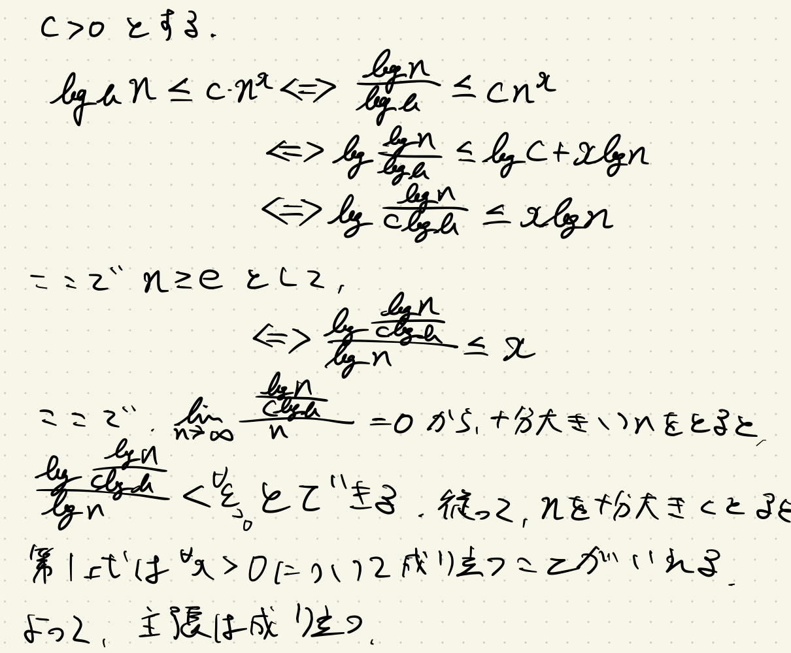

# 2.2 増加の漸近的オーダー

サイズ $n$ の入力に対するアルゴリズムの最悪の場合の計算時間が、ある関数 $f(n)$ を用いて、 $n$ の増加に伴い $f(n)$ に比例するかあるいはそれ以下の割合で増加するかという概念を以て議論する。

- $f(n)$ は大雑把で良い
  - あまりに精密な解析は極めて困難
  - 究極の目標は、同じような振る舞いをするアルゴリズムの広いクラスを特定すること
  - １ステップは言語系によって大小する
    - 高水準言語の１個の命令は、複数の低水準命令からなる
    - 本書での**１ステップ**とは、「変数に値を割り当てること」、「配列の要素を読むこと」、「１個のポインターをたどること」、「ある固定したサイズの整数に対して１回の算術演算をすること」のいずれかとする

## $\mathrm{O},\space\Omega,\space\Theta$ の記法

### 漸近的上界

入力サイズを $n$ としたときの、あるアルゴリズムの最悪の場合の計算時間を表す（非負整数の入力をとる）関数を $T(n)$ とする。別の関数 $f(n)$ を用いて、十分大きな $n$ に対して、関数 $T(n)$ が $f(n)$ の定数倍で上から抑えられるとき、 $T(n)$ は $\mathrm{O}(f(n))$ であるという。

より正確には、定数 $c>0$ と $n_0>0$ が存在して、すべての $n\ge n_0$ に対して、 $T(n)\le c\cdot f(n)$ となるとき、 $T(n)$ は $\mathrm{O}(f(n))$ であるという（ $c$ は $n$ に依存しないことに注意）。

このとき、 $f$ を $T$ の**漸近的上界**（asymptotic upper bound）、あるいは、 $T$ は $f$ によって**漸近的に上から抑えられる**という。

> 例： $T(n)=pn^2+qn+r$ の漸近的上界（ $p,q,r$ は正の定数）
>
> すべての $n\ge1$ に対して $qn\le qn^2$ かつ $r\le rn^2$ であるから、 $T(n)=pn^2+qn+r\le pn^2+qn^2+rn^2=(p+q+r)n^2$ が成り立つ。 $c=p+q+r$ と定めると、すべての $n\ge 1$ に対して、 $T(n)\le c\cdot n^2$ であるので、 $T(n)=\mathrm{O}(n^2)$ である。
>
> また $n\ge 1$ に対して、 $n^2\le n^3$ でもあるから、 $T(n)\le c\cdot n^2\le c\cdot n^3$ より、 $T(n)=\mathrm{O}(n^3)$ とも表現ができる。
>
> いずれの漸近的上界も定義を満足させる。

### 漸近的下界

入力サイズを $n$ としたときの、あるアルゴリズムの最悪の場合の計算時間を表す（非負整数の入力をとる）関数を $T(n)$ とする。定数 $\epsilon>0$ と $n_0>0$ が存在して、すべての $n\ge n_0$ に対して、 $T(n)\ge\epsilon\cdot f(n)$ となるとき、 $T(n)$ は $\Omega(f(n))$ であるという（ $\epsilon$ は $n$ に依存しないことに注意）。

このとき、 $f$ を $T$ の**漸近的下界**（asymptotic lower bound）、あるいは、 $T$ は $f$ によって**漸近的に下から抑えられる**という。

> 例： $T(n)=pn^2+qn+r$ の漸近的下界（ $p,q,r$ は正の定数）
>
> $T(n)=pn^2+qn+r\ge pn^2$ が成り立つ。 $\epsilon=p(>0)$ と定めると、すべての $n\ge 1$ に対して、 $T(n)\ge \epsilon\cdot n^2$ であるので、 $T(n)=\Omega(n^2)$ である。
>
> また $n\ge 1$ に対して、 $n^2\ge n$ でもあるから、 $T(n)\ge \epsilon\cdot n^2\ge \epsilon\cdot n$ より、 $T(n)=\Omega(n)$ とも表現ができる。
>
> いずれの漸近的下界も定義を満足させる。

### 漸近的にタイトな限界

関数 $T(n)$ が $O(f(n))$ かつ $\Omega(f(n))$ であるとき、 $T(n)$ は $\Theta(f(n))$ であるという。

このとき、$f(n)$ は $T(n)$ に対する**漸近的にタイトな限界**（asymptotically tight bound）であるという。

> 例： $T(n)=pn^2+qn+r$ の漸近的にタイトな限界（ $p,q,r$ は正の定数）
>
> 先の議論により、 $T(n)=\mathrm{O}(n^2)$ かつ $T(n)=\Omega(n^2)$ である。よって、 $T(n)=\Theta (n^2)$ である。

<!-- TODO: 右辺は左辺以上の情報を表
さない -->

---

漸近的にタイトな限界を直接得ることもできる。 $n$ を無限大に近づけると関数 $f(n)$ と $g(n)$ の比がある正定数に収束するならば、 $f(n)=\Theta(g(n))$である。

なぜならば、

$$\lim_{n\rightarrow\infty}{\frac{f(n)}{g(n)}}=c>0$$

であるので、極限の定義から、ある $n_0\ge0$ が存在して、 $n$ が $n_0$ を超えるとこの比の値は常に $\frac{1}{2}c$ と $2c$ の間にくることになる。したがって、すべての $n\ge n_0$ に対して $f(n)\le 2cg(n)$であり、 $f(n)=\mathrm{O}(g(n))$ が得られる。同様に、 $n\ge n_0$ に対して $f(n)\ge \frac{1}{2}cg(n)$ であり、 $f(n)=\Omega(g(n))$ が得られる。

---

極限の定義より、任意の正の定数 $\epsilon$ に対して、ある $n_0$ が存在して、 $n>n_0$ ならば、

$$\left|\frac{f(n)}{g(n)}-c\right|<\epsilon$$

が成り立つ。ここで、 $\epsilon=c$ と定めると、

$$
\begin{aligned}
\left|\frac{f(n)}{g(n)}-c\right|&lt c \\
-c&lt \frac{f(n)}{g(n)}-c&lt c \\
0&lt \frac{f(n)}{g(n)}&lt 2c \\
\end{aligned}
$$

同様に、 $\epsilon=\frac{1}{2}c$ と定めると、

$$
\begin{aligned}
\left|\frac{f(n)}{g(n)}-c\right|&<\frac{1}{2}c \\
-\frac{1}{2}c<\frac{f(n)}{g(n)}-c&<\frac{1}{2}c \\
\frac{1}{2}c<\frac{f(n)}{g(n)}&<\frac{3}{2}c \\
\end{aligned}
$$

以上により、

$$\frac{1}{2}c<\frac{f(n)}{g(n)}<2c$$

がいえる。

## 漸近的増加率の性質

### 推移律

#### (2.2)

(a) $f=\mathrm{O}(g)$ かつ $g=\mathrm{O}(h)$ ならば、 $f=\mathrm{O}(h)$ である  
(b) $f=\Omega(g)$ かつ $g=\Omega(h)$ ならば、 $f=\Omega(h)$ である

証明. (a) を示す。ある正定数 $c$ と $n_0$ に対して、すべての $n\ge n_0$ で $f(n)\le cg(n)$ で、また、ある（別の）定数 $c'$ と $n_0'$ に対して、すべての $n\ge n_0'$ で $g(n)\le c'h(n)$ である。したがって、 $n_0$ と $n_0'$ の両方よりも大きい $n$ をとれば、 $f(n)\le cg(n)\le cc'h(n)$ である。すなわち、すべての $n\ge \max{(n_0,n_0')}$ で $f(n)\le cc'h(n)$ であり、 $f=O(h)$ が得られる。

#### (2.3) $f=\Theta(g)$ かつ $g=\Theta(h)$ ならば、 $f=\Theta(h)$ である

証明. (2.2) により示される。

### 関数の和

#### (2.4) 二つの関数 $f$ と $g$ があり、他のある関数 $h$ に対して $f=\mathrm{O}(h)$ かつ $g=\mathrm{O}(h)$ であるならば、 $f+g=\mathrm{O}(h)$ である

証明. ある定数 $c$ と $n_0$ に対して、すべての $n\ge n_0$ で $f(n)\le ch(n)$ である。また、ある（別の）定数 $c'$ と $n_0'$に対して、すべての $n\ge n_0'$ で $g(n)\le c'h(n)$ である。したがって、 $n_0$ と $n_0'$ の両方よりも大きい $n$ で、すなわち、すべての $n>\max{(n_0,n_0')}$ で、 $f(n)+g(n)\le (c+c')h(n)$ であり、 $f+g=O(h)$ が得られる。

#### (2.5) $k$ を固定した整数とする。 $f_1,f_2,\ldots,f_k$ と $h$ は関数で、すべての $i$ で $f_i=O(h)$ であるとする。このとき、 $f_1+f_2+\cdots+f_k=O(h)$ である

証明. (2.4) を繰り返し用いる。

#### (2.6) $f$ と $g$ は（非負の値をとる）二つの関数で、 $g=O(f)$ であるとする。すると、 $f+g=\Theta(f)$ である。言い換えれば、 $f$ は、 $f$ と $g$ を組み合わせてできる関数 $f+g$ に対する漸近的にタイトな限界である

証明. すべての $n\ge0$ に対して $f(n)+g(n)\ge f(n)$ であるから、明らかに $f+g=\Omega(f)$ である。よって $f+g=\mathrm{O}(f)$ を示せばよい。

いま、 $g=\mathrm{O}(f)$ であり、 $f=O(f)$ が任意の関数 $f$ に対して成り立つので、 (2.4) より、 $f+g=O(f)$ が得られる。

<!-- ## 基本的な関数の漸近的限界

### 多項式

### 対数

### 指数関数 -->

## 基本的な関数の漸近的限界

アルゴリズムの解析に繰り返し現れるいくつかの関数がある. これらの中の最も基本的な関数(多項式, 大数, 指数関数)の漸近的性質を考える.

### 多項式

### _Def_ (多項式)

> $d \in \mathbb{Z}_{\ge 0}$ について $f(n) = \sum^{d}_{j=0} a_jn^j, n_d \neq 0$ で表されるものを多項式と言う.  
> ここで $d$ を多項式の次数(degree)という.

### _Prop_ (2.9)

> $f$ を次数 $d$ の多項式とし, 係数 $a_d$ は正とする. すると, $f = \mathrm{O}(n^d)$

#### _proof_

> $f(n) = \sum^{d}_{j=0} a_jn^j, n_d > 0$ とおく. ここで, すべての $n \ge 1$ について, $\sum^{d}_{j=0} a_jn^j \le \sum^{d}_{j=0} |a_j| n^j \le  \sum^{d}_{j=0} |a_j| n^d = (\sum^{d}_{j=0} |a_j|)n^d$ となる.  
> 従って, $f = \mathrm{O}(n^d)$

### _Prop_ (2.9.1)

> prop2.9 の条件のもとで, $f = \Omega(n^d)$ .

#### _proof_

> 同様に $f(n) = \sum^{d}_{j=0} a_jn^j, n_d > 0$ を表す. ここで $\sum^{d}_{j=0} a_jn^j  \ge a_dn^d - \sum^{d-1}_{j = 0} |a_j|n^j$ が任意の $n$ について成り立つ. ここで, $n$ が十分大きい時, $a_d - |a_{d-1}|\frac{1}{n} - ... - |a_0|\frac{1}{n^d} > 0$ となり, $a_d - |a_{d-1}|\frac{1}{n} - ... - |a_0|\frac{1}{n^d} \ge C > 0$ が取れる. よって, n が十分大きい時, $f(n) \ge Cn^d$ より, $f = \Omega(n^d)$ が言える.

prop2.2, 2.2.1 より, $f(n) = \Theta(n^d)$ が言える.

前節では, 効率性という, とらえどころのない概念を議論して多項式時間(polynomial time)の概念にたどり着いた. $\mathrm{O}(	\cdot	)$ の記法を用いると, 多項式時間の形式的定義は以下のように容易にできる.

### _Def_ (多項式時間アルゴリズム)

> 多項式時間アルゴリズム(polynomial-time algorithm)とは, その計算時間 $T(n)$ が $\mathrm{O}(n^d)$ であるアルゴリズムである.  
> ここで, $d$ は定数で, $n$ によらない.

#### _e.g._ $\mathrm{O}(n^2)$ や $\mathrm{O}(n^3)$ という計算時間の上界をもつアルゴリズムは多項式時間アルゴリズムである.

#### _Rem_:

> ここで, アルゴリズムの計算時間が $n$ の自然数城と言う形で描かれなくても,　多項式時間になりうる. 計算時間が $\mathrm{O}(n^{1.59})$ や $\mathrm{O}(\sqrt{n}) = \mathrm{O}(n^{\frac{1}{2}})$ であるようなアルゴリズムも多項式時間アルゴリズムである.  
> よく出る別の例として, $\mathrm{O}(n\log{n})$ の計算時間を持つアルゴリズムもまた多項式時間アルゴリズムである. 実際, すべての $n \ge 1$ について, $\log{n} \le n$ より, $n\log{n} \le n^2$ から, 計算時間が $\mathrm{O}(n^{2})$ であることが言える.

### 対数

### _Def_ (対数)

> $b^x = n$ を満たす $x$ を $\log_b{n}$ で表し, 対数と呼ぶ.

### _Thm_ (2.9)

> すべての $b > 1$ とすべての $x > 0$ に対して, $\log_b{n} = \mathrm{O}(n^x)$

#### _proof_

以下のように底の変換が可能である.

$$\log_a{n} = \frac{\log_b{n}}{\log_b{a}}$$

つまり, $\log_a{n} = \frac{1}{\log_b{a}}\log_b{n}$ より, $\log_a{n} = \Theta(\log_b{n})$ であるため, 漸近的な記法で限界を表すときには, 対数の底は重要ではない.

#### 指数関数

### _Def_ (指数関数)

> ある定数 $r$ に対して, $f(n) = r^n$ を指数関数と言う.

### _Thm_ (2.9)

> すべての $r > 1$ とすべての $d > 0$ に対して, $n^d = \mathrm{O}(r^n)$ である.

#### _proof_

> $r$ と $d$ を固定して $n$ について機能的に示す.  
> $n = 1$ のときは, $1^d = 1 < r = r^1$  
> $n \le k$ の時成り立つと仮定する. $n^{k+1} = n \cdot n^k < {}^\exist c \cdot r^k < rc \cdot r^k$ より成立.

対数時間アルゴリズムで底を指定しなかったように, どの指数関数かを特定せずに"アルゴリズムの計算時間は指数的である"ということがある. ただし, $\log{n}$ のときのような定数の底を無視した用法とちがい, "指数的"という言葉の使い方はいくぶんずさんである. 特に, $r > s > 1$ のような数に対しては, 決して $r^n = \Theta(s^n)$ にはならない.  
すなわち, 漸近的な観点からは, 指数関数は全て異なる. "アルゴリズムの計算時間が指数的である"と書いたときに意味することは, 少なくともある指数関数以上に早く増加するということである.  
対数, 多項式, 指数関数はアルゴリズムの計算時間を解析するときに出会う可能性のある関数では, ランドマークとして働く. 対数は多項式よりもゆっくりと増加し, 多項式は指数関数よりゆっくりと増加することをきちんとは青くしておくことが大切である.
