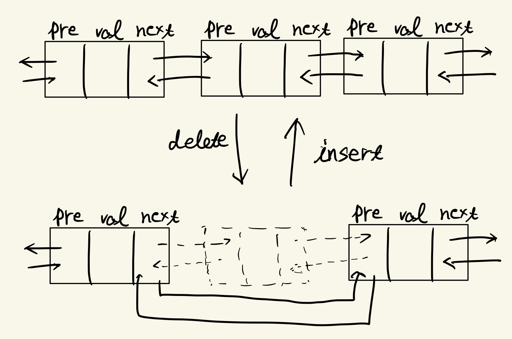

# 2.3 リストと配列による安定マッチングアルゴリズムの実装

アルゴリズムの漸近的な計算時間の解析をするためには, 必ずしもプログラムを実装する必要はない. しかし, アルゴリズムの計算ステップ数を抑えるためには, アルゴリズムで使用するデータ構造を考慮しなければならない.  
　具体的に**GS**アルゴリズムの実装について考える.前章で, 高々 $n^2$ 回の反復でこのアルゴリズムが終了することを示したが, ここでの実装では, 単に反復の回数を数えるのではなく, 実際の計算ステップ数を数えて, アルゴリズムの最悪の計算時間が $\mathrm{O}(n^2)$ となることを明らかにする. ここで, そのような上界を得るために必要なデータ構造は**リスト**(list)と**配列**(array)のみである.  
　ここで大切なのは, データ構造の選択はアルゴリズムの設計者に任されているということである. 入力に**前処理**を施して, 入力をより適したデータ構造に変換することもある.

### 配列とリスト

ある男性の好意順リストに焦点を絞って議論する. $n$ 個の要素のリストを表現する最も簡単な方法は, 長さ $n$ の配列 $A$ を用いて, $A[i]$ にリストの $i$ 番目の要素を記憶することである. 配列は以下のような性質を持っている.

- $i$ 番目の要素は $A[i]$ に直接アクセスすることで $\mathrm{O}(1)$ で取得できる.
- 特定の要素 $e$ を持つかどうかは, $A$ の要素の順序についての情報が何もないとき, $\mathrm{O}(n)$ ですべての要素を走査して調べる必要がある.
- 配列はソート済みならば, $e$ が含まれるかどうかは, 二分探索を用いて, $\mathrm{O}(\log{n})$ で決定できる.

安定マッチングアルゴリズムにおいて, 自由のみの男性からなるリストは時々刻々と変化していく. 配列を用いると, 要素の追加と削除に時間がかかる.  
　動的な要素の集合を管理するためのもっと良い別の方法としては, **連結リスト**(linked list)が挙げられる. 連結リストは各ノードがそれぞれの要素と次のノードのポインタを持つようなデータ構造である. あるノード $v$ が最後であるとき, 次のノードのポインタは`null`が設定される. また, `First`という先頭のノードを指すポインタも付随している.

```c
struct Node {
    val: int // 任意の型
    Next: *Node
}
```

前のノードのポインタを持つようにしたものを**二重連結リスト**(doubly linked list)という. $e$ が先頭ノードであるとき, $e$ の前のノードを指すポインタは`null`とする. `First`と同様に最後のノードを指すポインタ`Last`も持つものとする.

```c
struct Node {
    val: int // 任意の型
    Prev: *NOde
    Next: *Node
}
```

二重連結リストは次のような操作で更新できる.

- **削除**(deletion): $i$ 番目の要素をリストから削除する.
- **挿入**(insertion): $i$ 番目の要素の後ろに新しい要素を追加する.

これらは以下の図のようにして行われる.



なお, 先頭や末尾への操作では, `First`や`Last`を修正する作業が含まれる.  
　リストは配列と違いランダムアクセスができないという欠点がある. $i$ 番目の要素を取得するのに $\mathrm{O}(i)$ 時間かかってしまう.  
一方の形式で受け取った入力を他方の形式へ変換捨て用いることもしばしば起こる. 配列表現とリスト表現の間での変換は $\mathrm{O}(n)$ 時間でできる.

### 安定アルゴリズムマッチングの実装

配列とリストを用いて **G-S**アルゴリズムを実装する. 高々 $n^2$ 回の反復で終了することはすでに示しているが, 実際に**G-S**アルゴリズムが $n^2$ に比例する時間で走るように実装するには, 各反復が定数時間で実行できるようにしなければならない.  
　簡単のために, 壇上の集合は両方とも $\{1,2,...,n\}$ であるとする. 男性 $m$ の $i$ 番目に好きな女性を $\mathrm{ManPref} [m, i]$ とする. 同様に, $\mathrm{WomanPref} [w,i]$ を女性 $w$ が $i$ 番目に好きな男性とする. 各人がそれぞれ長さ $n$ のリストを持つので, $2n$ 人すべての好意順リストを表すのに必要な記憶領域は $\mathrm{O}(n^2)$ である.  
　アルゴリズムの各ステップ考え, 効率よく実装できるデータ構造を見極めることが必要になる. すなわち ,本質的には, 以下の四つの操作を定数時間で実行できるようにする.

(1) 自由の身の男性を見つける.  
(2) 各男性 $m$ について, $m$ がまだプロポーズしていない女性で最も好きな人を見つける.  
(3) $w$ が婚約しているかを調べる. 婚約しているときには $w$ のパートナーを見つける.  
(4) $w$ は男性 $m$ と $m'$ のどちらが好きかを決定する.

操作(1)は自由のみの男性の集合を連結リストとして管理することで効率的にできる. 自由の身の男性を選ぶときには, この連結リストの先頭の男性を $m$ を選ぶことにすればよい. $m$ が婚約するときと, $m'$ が新しく自由の身になるときはそれぞれリストの先頭に挿入あるいは先頭を削除すればよい. これらはすべて定数時間で可能である.  
　操作(2)については, 配列 $\mathrm{Next}$ で管理することで効率的にできる. Next $[m]$ に $m$ のリスト中で次にプロポーズするする女性の位置を記録する. 最初は, すべての $m$ について $\mathrm{Next}[m] = 1$ である. $m$ は $w = \mathrm{ManPref}[m, \mathrm{Next}[m]]$ にプロポーズする. その後, $\mathrm{Next}[m]$ を $1$ 増加させる.  
　操作(3)は長さ $n$ の配列 $\mathrm{Current}$ で管理することで効率的にできる. $\mathrm{Current}[w]$ は現在のパートナー $m'$ を表す. 最初はすべての女性 $w$ について, $\mathrm{Current}[w]$ を `null` とする.  
　以上より(1)~(3)は定数時間で可能.  
操作(4)の効率的な実装が最も困難. $\mathrm{WomanPref}$ を用いて $m$ と $m'$ を見つけようとすると, $\mathrm{O}(n)$ かかる.  
　そこで, アルゴリズムの開始時に, サイズ $n \times n$ の配列 $\mathrm{Ranking}$ を実際に構成することにする. 女性 $w$ が全男性の中で男性 $m$ が何番めに好きかを表すものである. $w$ が $i$ 番目にすきな女性が $m$ とすると, $\mathrm{Ranking}[w,m] = i$ である. この配列の初期設定は $\mathrm{O}(n^2)$ でできる. $m$ と $m'$ の比較は, $\mathrm{Ranking}[w,m]$ と $\mathrm{Ranking}[w,m']$ の値を比較す流だけでよい.  
　これで操作(4)も定数時間で実行できることがわかった.

### _Thm_ (2.10)

> **G-S**アルゴリズムは $\mathrm{O}(n^2)$ 時間で走るように実装できる.

[実装](code/GS.c)
