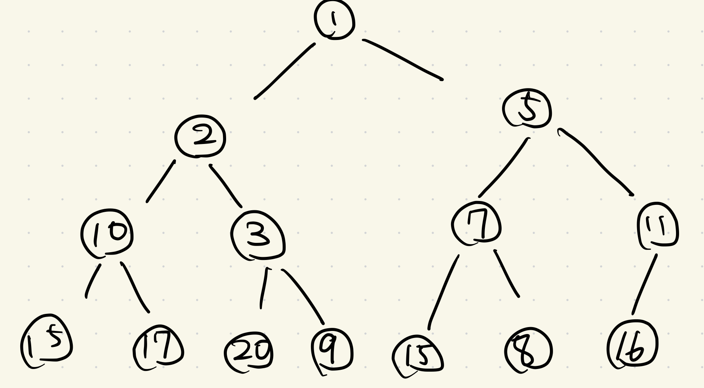

# 2.5 より複雑なデータ構造:優先順位付きキュー

全探索を本質的に改善するようなアルゴリズムを求めたい. 具体的には, 多項式時間で解けるアルゴリズムを求めたい.  
本説では, 最もよく用いられる洗練されたデータ構造の一つである優先順位付きキュー(priority queue)を考える.

## 問題 2.1 優先順位付きキューの実装(Implementing a Priority Queue):

優先順位付きキューは動的に変化する集合を表現する方法の一つ. 挿入と削除, そして取得をサポートしたい.

### _Def_ (優先順位付きキュー)

> 要素の集合 $S$ を管理するデータ構造で, 次のような性質と操作をサポートするものを優先順位付きキューという.
> 性質:
>
> - 各要素 $v \in S$ には要素 $v$ の優先度を表す $\mathrm{key}(v)$ が付随していて, キーが小さいほど優先順位が高いものとする.
>
> 操作:
>
> - 挿入( $\mathrm{Insert}$ )
> - 削除( $\mathrm{Delete}$ )
> - 最小要素の取得( $\mathrm{FindMin}$ )

#### _Rem_: 削除と最小要素の取得をまとめて, 最小要素の削除( $\mathrm{ExtractMin}$ )とする定義もある.

優先順位付きキューの各操作の時間量を考える. 以下では, 要素数が高々 $n$ のとき, 各操作を $\mathrm{O}(\log{n})$ 時間で行う優先順位付きキューの実装法を示す.

### _Thm_ (2.11)

> $\mathrm{O}(n)$ 回の優先順位付きキューの操作で, $n$ 個の数をソートできる.

#### _proof_

> 優先順位付きキュー $H$ を用意する. 各要素を $H$ に挿入し, 最小の数を 1 個ずつ全て取り出すことで実現される.

全ての操作が $\mathrm{O}(\log{n})$ と仮定すると, $\mathrm{O}(n\log{n})$ でソートできることがわかる. よって, $\mathrm{O}(\log{n})$ 時間は目指すべき"正しい"上界であることが言える.

### 優先順位付きキューを実装するためのデータ構造

以下では**ヒープ**(heap)と呼ばれるデータ構造を用いて優先中伊月キューを実装する. ヒープの説明の前に, 単純なアプローチで優先順位付きキューを実装するとどうなるかを考える.

1. 要素をリストに入れて, 最小要素のポインタ`Min`をもつ.
   - 挿入は簡単
   - 最小値の取得も簡単
   - 最小値を削除した後, 新しい最小値を見つけるのに $\mathrm{O}(n)$ 時間かかる
1. 要素をキーでソートしておく
   - 最小値の削除は容易
   - 挿入が困難
     - 要素を配列で表現する
       - 挿入位置の発見は二分探索により $\mathrm{O}(\log{n})$ 時間
       - 挿入に $\mathrm{O}(n)$ 時間かかる
     - 要素を二重連結リストで表現する
       - 挿入は $\mathrm{O}(1)$ 時間
       - 挿入位置の特定に $\mathrm{O}(n)$ 時間かかる

### ヒープの定義

上記のような単純なアプローチでは $\mathrm{O}(n)$ 時間かかる. そこで, ヒープが用いられる.

### _Def_ (ヒープ)

> 平衡二分木であって次の条件を満たすものをヒープ(heap)と呼ぶ.
>
> > 全ての要素 $v$ に対して, $v$ がノード $i$ にあるとすると, $i$ の親の要素 $w$ は $\mathrm{key}(w) \le \mathrm{v} $ を満たす.
>
> この条件を満たすとき, **ヒープ順**(heap order)であるという.



ヒープの利用の前に, ヒープをどのように実現するかを考える必要がある. ポインタを用いた実装も可能である.

```c
struct node
{
    int element;
    struct node *parent;
    struct node *left;
    struct node *right;
}
```

ポインタによる実装の例

一方, 要素の最大数 $N$ が既知のときは, 長さ $N$ の配列 $H$ による実現が可能である. $H[1]$ が根である. 位置 $i$ のノードに対して, その子は位置 $\mathrm{leftChild}(i) = 2i$ と $\mathrm{rightChild}(i) = 2i + 1$ にある. 親は $\lfloor{i/2}\rfloor$ の位置にある. 要素は順番に詰めていくことで, 平衡二分木となる.

### ヒープ操作の実装

最小要素の取得は $\mathrm{O}(1)$ で可能.  
挿入は最後尾に要素を入れた後, 修正を施すことで, ヒープ順を保つようにする. その修正には手続 $\textrm{Heapify-up}$ を用いる.

> $\textrm{Heapify-up}(H, i)$ :  
> &nbsp; &nbsp; $\textrm{If }$ $i > 1$ $\textrm{then}$  
> &nbsp; &nbsp; &nbsp; &nbsp; $j = \textrm{parent}(i) = \lfloor i/2 \rfloor$ とする  
> &nbsp; &nbsp; &nbsp; &nbsp; $\textrm{If }$ $\textrm{key}(H[i]) < \textrm{key}(H[j])$ $\textrm{then}$  
> &nbsp; &nbsp; &nbsp; &nbsp; &nbsp; &nbsp; $H[i]$ と $H[j]$ を入れ替える  
> &nbsp; &nbsp; &nbsp; &nbsp; &nbsp; &nbsp; $\textrm{Heapify-up}(H, j)$  
> &nbsp; &nbsp; &nbsp; &nbsp; $\textrm{Endif}$  
> &nbsp; &nbsp; $\textrm{Endif}$

### _Def_

> $i$ 番目の要素 $v$ について $\alpha \ge \textrm{key}(v)$ が存在して, $\textrm{key}(v)$ を $\alpha$ まで大きくするとヒープ順を満たすとき, $H[i]$ のキーは小さすぎるが $H$ はほとんどヒープであるという.

### _Thm_ (2.12)

> $H[i]$ のキーは小さすぎるが $H$ はほとんどヒープのとき. 手続 $\textrm{Heapify-up}$ はヒープの性質を $\mathrm{O}(\log{i})$ 時間で修正する.

#### _proof_

> 帰納的に示される.  
> $i = 1$ のときは $H$ はヒープ.  
> $i> i$ を考える. 入れ替えは $\mathrm{O}(1)$ で可能. 入れ替え後はヒープであるかほとんどヒープ.

### _Cor_

> $n$ 個の要素を持つヒープへの新しい要素の挿入は, $\textrm{Heapify-up}$ を用いて $\mathrm{O}(\log{n})$ 時間でできる.

#### _proof_

> Thm2.12 に $i = n$ を適用.

次に要素の削除を考える. 通常は最小値の削除のみが要求される. これは根のキーを見つけてそれを削除することに対応する. この操作を $\textrm{ExtractMin}(H)$ と呼ぶ. ここでは, 位置 $i$ にある要素を削除する $\textrm{Delete}(H, i)$ を実装する. $i$ 番目を削除した後, $n$ 番目を $i$ 番目に移す. その後, ヒープ順を保つように, 修正を加える.  
$i$ 番目の要素のキーが親より小さければ $\textrm{Heapify-up}$ を, 子より大きければ以下の $\textrm{Heapify-down}$ を適用する.

> $\textrm{Heapify-down}(H, i)$ :  
> &nbsp; &nbsp; $n = \textrm{length}(H)$ とする  
> &nbsp; &nbsp; $\textrm{If }$ $2i > n$ $\textrm{then}$  
> &nbsp; &nbsp; &nbsp; &nbsp; $H$ はそのままにして停止する  
> &nbsp; &nbsp; $\textrm{Else if}$ $2i < n$ $\textrm{then}$  
> &nbsp; &nbsp; &nbsp; &nbsp; $\textrm{left} = 2i$ , $\textrm{right} = 2i+1$ とする  
> &nbsp; &nbsp; &nbsp; &nbsp; $\textrm{key}(H\textrm{[left]})$ と $\textrm{key}(H\textrm{[right]})$ の小さいほうの位置を $j$ とする  
> &nbsp; &nbsp; $\textrm{Else if}$ $2i = n$ $\textrm{then}$  
> &nbsp; &nbsp; &nbsp; &nbsp; $j = 2i$ とする  
> &nbsp; &nbsp; $\textrm{Endif}$  
> &nbsp; &nbsp; $\textrm{If }$ $\textrm{key}(H\textrm{[j]}) < \textrm{key}(H\textrm{[i]})$ $\textrm{then}$  
> &nbsp; &nbsp; &nbsp; &nbsp; &nbsp; &nbsp; $H[i]$ と $H[j]$ を入れ替える  
> &nbsp; &nbsp; &nbsp; &nbsp; &nbsp; &nbsp; $\textrm{Heapify-down}(H, j)$  
> &nbsp; &nbsp; &nbsp; &nbsp; $\textrm{Endif}$  
> &nbsp; &nbsp; $\textrm{Endif}$

### _Def_

> $i$ 番目の要素 $v$ について $\alpha \le \textrm{key}(v)$ が存在して, $\textrm{key}(v)$ を $\alpha$ まで小さくするとヒープ順を満たすとき, $H[i]$ のキーは大きすぎるが $H$ はほとんどヒープであるという.

### _Thm_ (2.13)

> $H[i]$ のキーは大きすぎるが $H$ はほとんどヒープのとき. 手続 $\textrm{Heapify-down}$ はヒープの性質を $\mathrm{O}(\log{n})$ 時間で修正する.

#### _proof_

> 帰納的に示される.  
> 省略

### _Cor_

> $n$ 個の要素を持つヒープから, $\textrm{Heapify-up}$ $\textrm{Heapify-down}$ を用いて $\mathrm{O}(\log{n})$ 時間で 1 個の要素を削除できる.

#### _proof_

> Thm2.12 と Thm2.13 より明らか.

高々 $N$ 個の要素しか持たないという制約のついた優先順位付きキューは $\textrm{Heapify-up}$ と $\textrm{Heapify-down}$ の操作をもつヒープのデータ構造を用いて, 効率よく実装することができる. よく用いられる操作を以下に要約しておく.

- $\textrm{StartHeap}(N)$ : ヒープの初期化. $\mathrm{O}(N)$
- $\textrm{Insert}(H, v)$ : 要素 $v$ を $H$ に挿入. $\mathrm{O}(\log{n})$
- $\textrm{FindMin}(H)$ : $H$ の最小値を取得. $\mathrm{O}(1)$
- $\textrm{Delete}(H,i)$ : 位置 $i$ の要素を削除. $\mathrm{O}(i)$
- $\textrm{ExtractMin}(H)$ : ヒープの最小値の削除. $\textrm{FindMin}+\textrm{Delete}$ / $\mathrm{O}(\log{n})$

ヒープはグラフアルゴリズムの中で用いられることが多い. ヒープ中のどこにあるかとは無関係に操作をしたいことがある. そのようなときは, 別の配列 $\textrm{Position}$ を用いる.

[ヒープの実装](code/heap.c)
