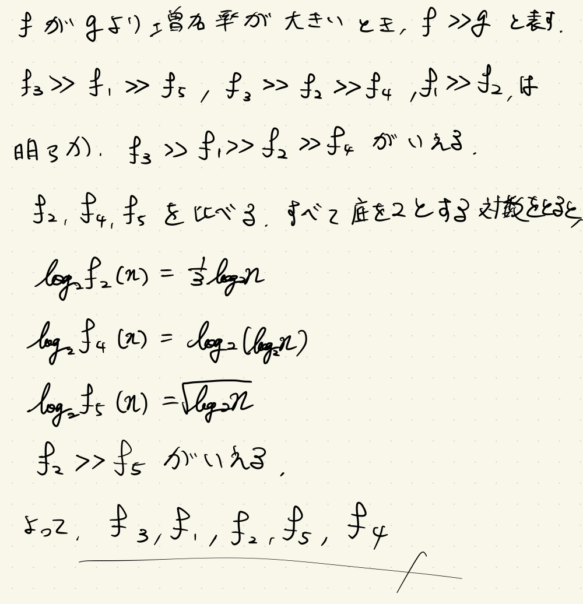
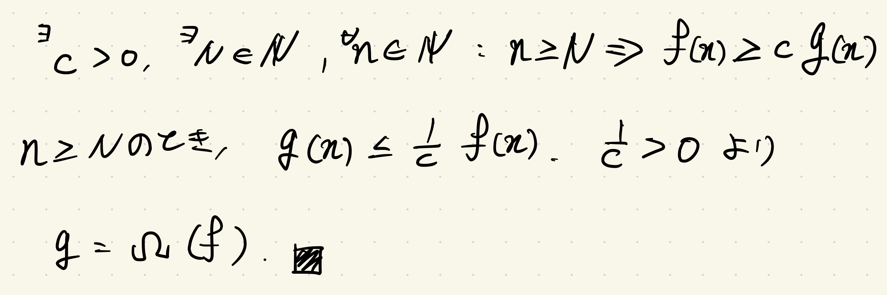

# 解答付き演習問題

## 解答付き演習問題 1

以下の五つの関数を増加率の小さい順に並べ替えよ.

$$
\begin{align*}
f_1(n) &= 10^n \\
f_2(n) &= n^{1/3} \\
f_3(n) &= n^n \\
f_4(n) &= \log_2{n} \\
f_5(n) &= 2^{\sqrt{\log_2{n}}}
\end{align*}
$$

解答:

## 解答付き演習問題 2

$f$ と $g$ は非負関数で, $f = \mathrm{O}(g)$ .このとき, $g = \Omega(f)$ を示せ.

解答:

