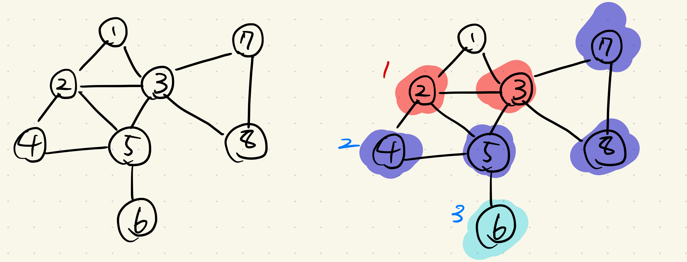
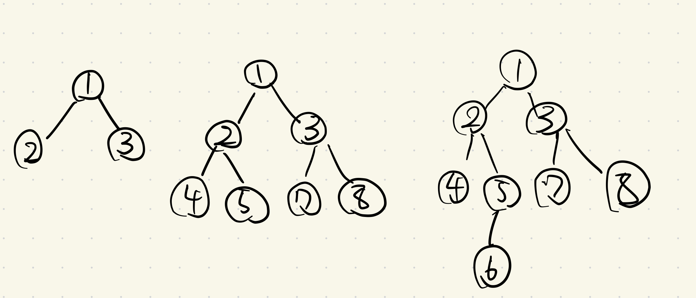
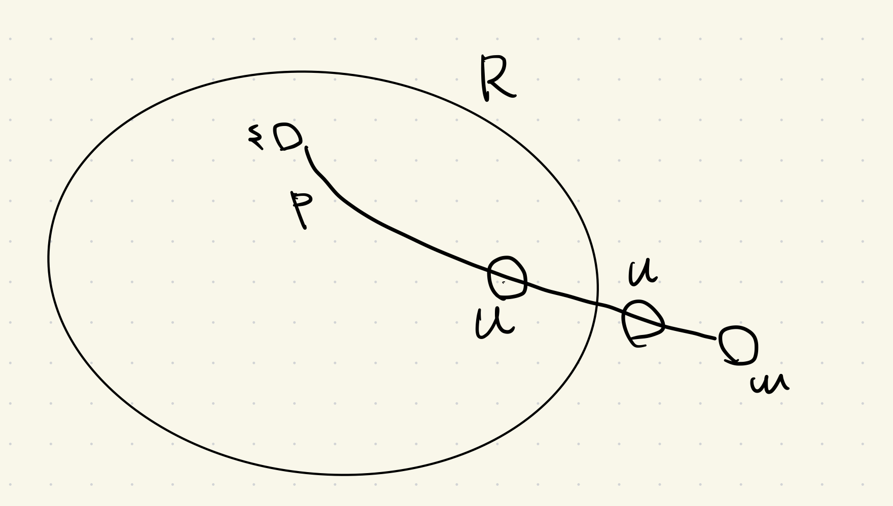

# 3.2 グラフの連結性とグラフ走査

グラフの 2 点間の連結性についての初歩的で基本的なアルゴリズムを考察する. 次の問題を考える.

### _Def_ ($s \text{-} t$ 連結性)

> $G = (V, E)$ : グラフ  
> $s, t$ : グラフ上の点  
> $s$ から $t$ までのパスが $G$ に存在するかという問題を $s\textrm{-}t$ 連結性($t\textrm{-}s$ connectivity)という.

ここでは, 幅優先探索(BFS)と深さ優先探索(DFS)を考える.

## 幅優先探索

$s\textrm{-}t$ 連結性を判定する最も単純なアルゴリズムは, 幅優先探索(BFS: breadth-first search)であろう. $s$ から辺をたどって, 各時点でたどり着いた点を全て一つの層(layer)にまとめる. BFS アルゴリズムで構成される層 $L_1, L_2, L_3, \dots, $ は以下のように定義される.

### _Def_

> - 層 $L_1$ は $s$ の全ての隣接点からなる.($L_0 = \{s\}$ とすることもある.)
> - 層 $L_{j+1}$ は $L_j$ に含まれる点と隣接する点のうち $L_1, L_2, L_3, \dots, L_{j-1}$ に含まれないもの全体.

ここで, $L_j$ は $s$ からの距離が $j$ であるような点の集合になっていることに注意.

### _Prop_

> 各 $j \ge 1$ に対して, BFS で構成される層 $L_j$ は, $s$ からの距離がちょうど $j$ である点の集合である. $s$ から $t$ へパスがあるとき, そしてそのときのみ, t はいずれかの層に含まれる.

幅優先探索では, $s$ から到達できる点の集合が $s$ を根とする木 $T$ で自然に表現されて得られる. 点 $u$ から 点 $v$ への辺を見つけた時に, 辺 $(u, v)$ を木 $T$ に加える.このようにして構成された木 $T$ を幅優先探索木(BFS 木(BFS tree))と呼ぶ.

### _Thm_ (3.4)

> $T$ を幅優先探索木とし, $x$ と $y$ をそれぞれ層 $L_1$ と層 $L_2$ に属する $T$ の点とする. さらに, $(x, y)$ を $G$ の辺とする. すると, $i$ と $j$ は差が高々 $1$ である.

#### _proof_

> (略)

### 連結成分の探査法

### _Def_ (連結成分)

> グラフ $G$ において出発点 $s$ から到達可能な点の集合 $R$ を $s$ を含む $G$ の連結成分(connected component)とよぶ.

BFS アルゴリズムで発見される点の集合は, 連結成分となる. $s$ を含む $G$ の連結成分が得られれば, $t$ がこれに含まれるかを確かめるだけで $s\textrm{-}t$ 連結性問題を解くことができる.  
BFS は連結成分を求める一つの方法にすぎない. $s$ から $G$ をどのような順番で"探査"しても 連結成分 $R$ を得ることができる. 以下のようなアルゴリズムを走らせる.

> $s$ から到達可能な点の集合 $R$ の計算:  
> $R = \{s\}$ と初期設定する  
> $\textrm{While}$ $u \in R$ かつ $v \notin R$ である辺 $(u, v)$ が存在する  
> &nbsp; &nbsp; $v$ を $R$ に加える  
> $\textrm{Endwhile}$

### _Thm_ (3.5)

> アルゴリズムが終了した時点での集合 $R$ は, $s$ を含む $G$ の連結成分である.

#### _proof_

> $w \notin R$ について, $s\textrm{-}w$ パス $P$ が存在するとする. すると, ある $u \in R \cap P$ に隣接する $v$ が存在して, $v \notin R$ . これはアルゴリズムの終了条件に矛盾する.

上のアルゴリズムにおいて, $v$ が $R$ に加えられたときの辺を記憶しておくと, $s$ から $t$ までのパスを復元できる.  
$R$ を拡大していく上記のアルゴリズムは, 詳細を省略している. 辺の選び方に自由度がある. BFS は特殊な一例である. 効率的に辺を選ぶアルゴリズムは他にも存在する. これから, そのうち一つである深さ優先探索について議論する.

## 深さ優先探索

迷路を進むように, 最初の辺をたどっていくことを"行き止まり"(dead end)にあたるまで繰り返す. 行き止まりに当たった場合は, 新しい店に向かう辺がある点まで戻り, 上記を繰り返す. このようなアルゴリズムを深さ優先探索( $\textrm{DFS}$ : depth-first search)という.  
$\textrm{DFS}$ もまた前述の一般的な連結成分拡大アルゴリズムの特殊な一例である. それは, 再帰的な形で記述できる.

> $\textrm{DFS}(u)$ :  
> &nbsp; &nbsp; $u$ を探索開始済みとマークして $u$ を $R$ に加える.  
> &nbsp; &nbsp; $\textrm{For }$ $u$ に接続する各辺 $(u, v)$  
> &nbsp; &nbsp; &nbsp; &nbsp; $\textrm{If }$ $v$ がまだ探索開始済みとマークされていない $\textrm{then}$  
> &nbsp; &nbsp; &nbsp; &nbsp; &nbsp; &nbsp; $\textrm{DFS}(v)$ を再帰的に呼ぶ  
> &nbsp; &nbsp; &nbsp; &nbsp; $\textrm{Endif}$  
> &nbsp; &nbsp; $\textrm{Endfor}$

$s\textrm{-}t$ 連結性には, 最初に全ての点を未探索と初期設定して, $\textrm{DFS}(s)$ を呼べば良い.

$\textrm{DFS}(u)$ が呼び出されている最中に $\textrm{DFS}(v)$ が呼び出されたとき、辺 $(u, v)$ を加えていくことで, 深さ優先探索木($\textrm{DFS}$ 木(DFS tree))と呼ばれる木が自然に得られる.

### 全ての連結成分の集合

### _Thm_ (3.8)

> グラフの任意の 2 点 $s$ , $t$ に対して, それらの連結成分は, 同一であるか互いに素である.

#### _proof_

> 略
