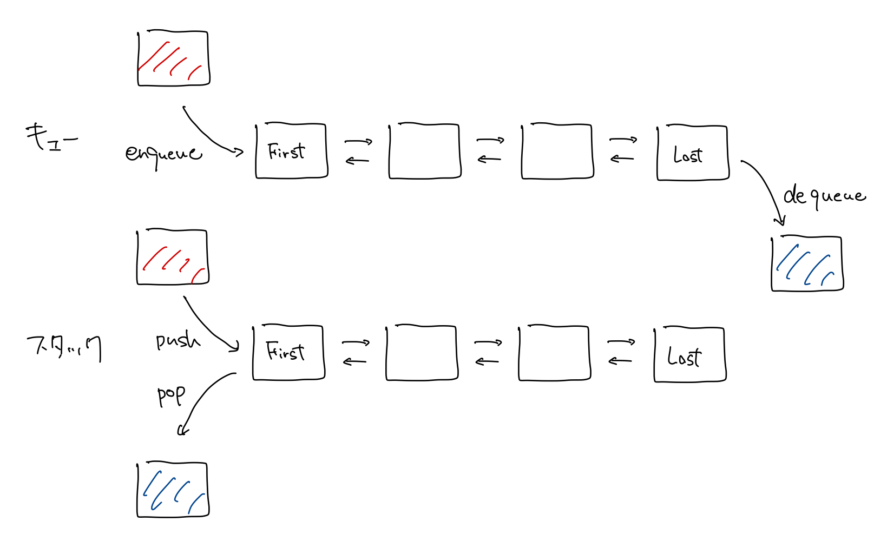
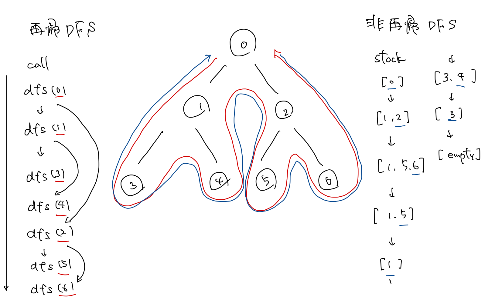

# 3.3 キューとスタックを用いたグラフ走査

## グラフの表現

グラフの表現には、以下に示す二つの基本的な方法がある。本書では隣接リストによる表現のみが用いられるが、まずはじめに、これらの方法とその間のトレードオフについて議論を行う。

グラフ $G=(V,E)$ には、点数 $|V|$ と辺数 $|E|$ の自然なパラメータが付随する。これ以降 $n=|V|,m=|E|$ を用いる。

一般的に $n$ と $m$ の比較は明白ではないため、入力を読むのにかかる時間 $\mathrm{O}(n+m)$ を**線形時間**（linear time）ということにする。グラフが連結である場合、 $m\ge n-1$ であるから $\mathrm{O}(n+m)=\mathrm{O}(m)$ であることに注意したい。

### 隣接行列

$n$ 点からなるグラフ $G=(V,E)$ を対象として、点集合は $V=\{1,\ldots,n\}$ であると仮定する。ここで $u$ と $v$ が隣接するとき、 $A[u,v]=1$ 。そうでないとき $A[u,v]=0$ とする $n\times n$ の隣接行列 $A$ を考える。（無向グラフなら対称行列である）

任意の辺の存在が $\mathrm{O}(1)$ で判定できる一方、以下の欠点が存在する。

- グラフの辺の本数に関わらず、 $O(n^2)$ の領域を要する
- 多くのグラフアルゴリズムでは、与えられた頂点 $v$ に隣接するすべての頂点を調べることが求められる。隣接行列でこれを行う場合 $\Theta{(n)}$ 時間を要するが、実用上のグラフでは、それぞれの点に隣接する点は $n$ よりはるかに少ない場合が多い

### 隣接リスト

隣接行列よりスパースな表現として隣接リストがある。各点 $v$ に対して $v$ と辺で結ばれているすべての点からなるリストが付随する。より詳しく言うと、配列 $Adj$ を用いて、各 $Adj[v]$ が点 $v$ のすべての隣接点からなるリストへのポインタであるようにする。尚、無向グラフ $G=(V,E)$ では、各辺 $e=(v,w)\in E$ は 隣接リストに2回現れる。すなわち、 $u$ リストに $v$ が、 $v$ のリストに $u$ がといった具合である。

隣接行列が $\mathrm{O}(n^2)$ の領域を要した一方、隣接リストでは $\mathrm{O}(n+m)$ でよい。（証明は後述）

### (3.9) $\sum_{v\in V}{n_v}=2m$ である

**証明．** 各辺 $e=(v,w)$ はこの和で2回数えられる。 $n_v$ で1回と $n_w$ で1回である。したがって、すべての辺で和をとると $2m$ であるが、それはすべての点 $v$ での $n_v$ の和と等しい。

### (3.10) グラフの隣接行列表現が $O(n^2)$ の領域を必要とするのに対して、隣接リスト表現は $O(m+n)$ の領域しか必要としない

**証明．** 各点の隣接点に対応する配列へのポインタを含む配列を $\mathrm{O}(n)$ で初期化する。先述の通り、一つの辺に対して隣接リストに2回点が出現するので、これらのリストのための領域として $2m=\mathrm{O}(m)$ が必要となる。

||隣接行列|隣接リスト|
|---|---|---|
|必要領域| $O(n^2)$ | $O(m+n)$|
|辺の存在判定| $O(1)$ | $O(n)$ |
|隣接点の検索[^1] | $O(n)$ | $O(1)$ |

[^1]: 隣接点1点あたりの読み出す時間

## キューとスタック

BSアルゴリズムでは、出力は入力リストの順番に依存しないことが（繊細な証明により）確認できたが、他方、DFSやBFSなどを含む他のアルゴリズムでは、この順番が極めて重要になることが多い。

要素集合を管理する最も単純で自然な方法として、以下の二つの方法がある。

### キュー

キューは、**先入れ先出し**（first-in, first-out）（FIFO）順で集合の要素を管理する。すなわち入れた順番で要素を取り出す。

### スタック

スタックは、**後入れ後出し**（last-in, last-out）（LIFO）順で集合の要素を管理する。すなわち、最後に入れたものを最初に取り出す順番で要素を管理する。



## 幅優先探索の実装

```py
# BFS

n: int  # 頂点数
m: int  # 辺数
graph: list[list[int]]  # 隣接リスト

s: int  # 出発点

# discovered[v] := 頂点vが発見済みであるか
discovered = [False] * n
discovered[s] = True

# l[i] := 出発点sから距離iの点の集合
l: list[list[int]] = [[s]]

i = 0  # 層カウンター
t: list[list[int]] = [[] for _ in range(n)]  # bfs木

while len(l[i]) > 0:
    l.append([])
    for u in l[i]:
        for v in graph[u]:
            if not discovered[v]:
                discovered[v] = True
                t[u].append(v)
                l[i + 1].append(v)
    i += 1

```

この実装では各層の点を一度に処理するため、各層 $l[i]$ はキューあるいはスタックのいずれで管理しても問題ない。

### (3.11) BFSアルゴリズムの上記の実装は、グラフが隣接リスト表現で与えられれば、入力サイズに線形の $O(m+n)$ 時間で走る

**証明．** 各点は高々1個のリスト(`l[...]`)上に存在するので、 `for u in l[i]` のループは、各点に対して高々1回実行される。ここで点 $u$ の次数を $n_u$ とする。Forループ `for v in graph[u]` で点 $u$ に接続する辺を考慮するときに費やされる時間は、一つの辺が $O(1)$ で扱えることから、 $\mathrm{O}(n_u)$ となり、したがって、すべての点で総和をとると、 $\mathrm{O}(\sum_{u\in V}{n_u})$ となる。(3.9) より $\sum_{u\in V}{n_u}=2m$ であるので、全体のアルゴリズムで辺の考慮に費やされる時間は $\mathrm{O}(m)$ となる。その他、リストの初期設定と配列 `discovered` の管理に $\mathrm{O}(n)$ かかる。したがって、全体の計算量 $\mathrm{O}(n+m)$ が得られる。

## 深さ優先探索の実装

```py
# DFS

n: int
m: int
graph: list[list[int]]

# explored[v] := vに接続した辺を走査した
explored = [False] * n

stack = [s]
while stack:
    u = s.pop()
    if not explored[u]:
        for v in graph[u]:
            stack.append(v)
        explored[u] = True

```

### (3.12) 上記のアルゴリズムは、各隣接リストの点を逆順に処理することにすれば、前節の再帰的なDFS手続きと完全に同じ順番で点を訪問するという意味で、DFSを実装している

```py
# DFS(recursive)

def dfs(u):
    if not explored[u]:
        explored[u] = True
        for v in graph[u]:
            dfs(v)

explored = [False] * n
dfs(s)

```



```py
# DFS(recursive but same order as non-recursive DFS)

def dfs(u):
    if not explored[u]:
        explored[u] = True
        for v in reversed(graph[u]):
            dfs(v)

explored = [False] * n
dfs(s)

```

### (3.13) DFSアルゴリズムの上記の実装は、グラフが連結リスト表現で与えられれば、入力サイズに線形の $O(m+n)$ 時間で走る

**証明．** スタックへの点の追加・取り出し操作は1点あたり $\mathrm{O}(1)$ でできる。スタックから取り出される点は前もって追加されていることを考慮すると、スタックに点が追加される回数を数えればよい。(3.11)と同様に、 $n_v$ を点 $v$ の次数とする。 $n_v$ 個の隣接点のうち1点が探査されるごとに、 $v$ はスタックに加えられ、したがってスタックに加えられる点の総数は高々 $\sum_{v}{n_v}=2m$ である。

## すべての連結成分の集合の計算

任意の頂点からBFSあるいはDFSを実行し、連結成分を構築する。到達できなかった頂点が存在すれば、そこからまた1点を任意に選び探索を開始する。以下、未探索な点がなくなるまでこれを繰り返せばよい。

BFSあるいはDFSを何度実行したとしても、各反復で考慮される連結成分に含まれる点の個数と辺の個数に比例する時間しか消費されない。したがって、このアルゴリズムの全体の計算時間も $\mathrm{O}(n+m)$ である。
