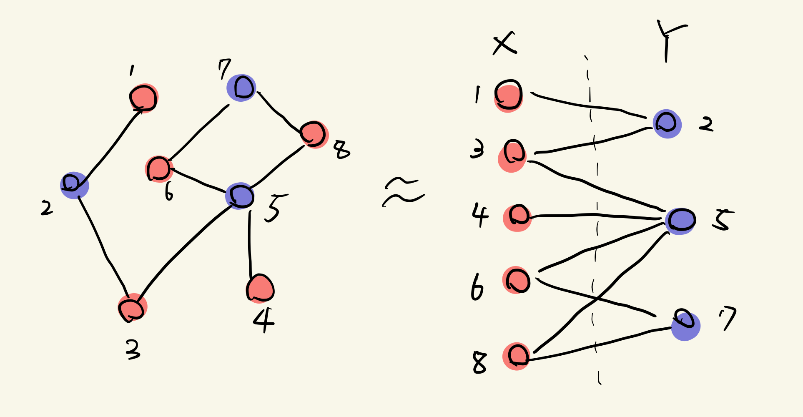
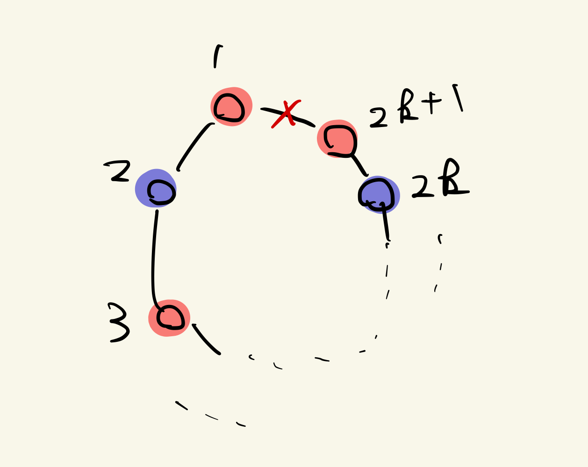
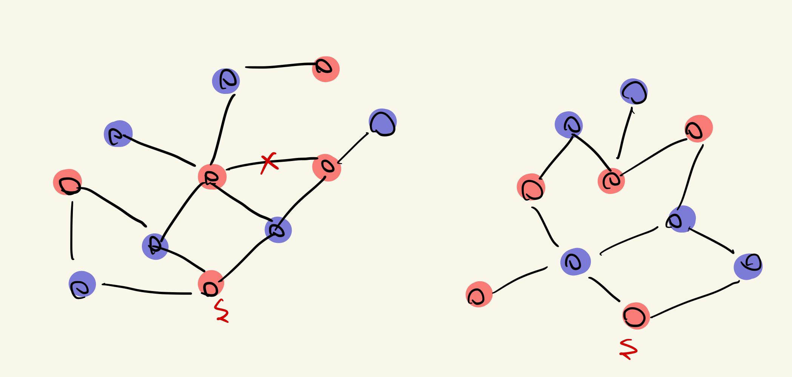
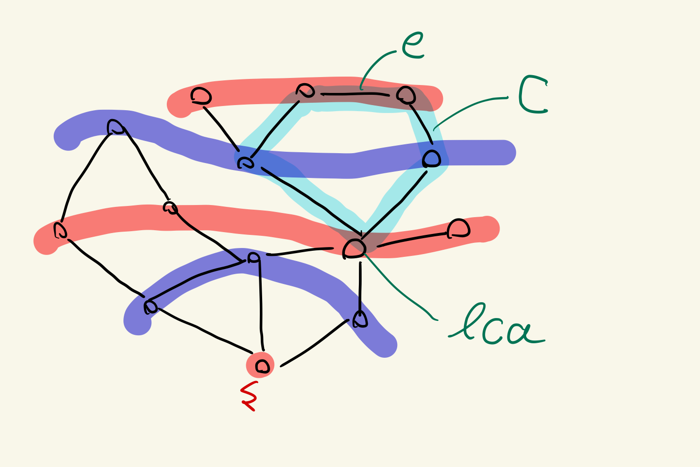

# 3.4 二部グラフ性の判定:幅優先探索の応用

### _Def_ (二部グラフ)

> $G = (V, E)$ : グラフ  
> $V = X \oplus Y$ であって, 任意の $e$ が $X$ と $Y$ の点を結ぶように分割できるとき, $G$ は二部グラフであるという.

イメージとして, 集合 $X$ の点はすべて赤で, 集合 $Y$ の点はすべて青で彩色されていて, 任意の辺の両端点が赤と青のとき二部グラフであると言える.

## 問題 3.1 二部グラフ性の判定(**Bipartiteness**): 問題の背景と定式化

ここでは, まず非二部グラフの自然な例をいくつか見ていく.  
三角形(3 点からなる閉路)は二部グラフではない. 実際, 1 点赤でもう 1 点を青とすると, 最後の 1 点がどの色でも彩色できなくなる. 一般に, 以下が言える.

### _Lem_

> 長さ奇数の閉路は二部グラフではない

#### _proof_

> 閉路を $C$ とする. $C$ の点を閉路の順に $1, 2, \dots , 2k, 2k+1$ $(k \ge 1)$ とする.  
> ここで, $1$ を赤にすると, $2$ は青になる. これを繰り返すと, $2l + 1$ は赤で $2l$ は青になる( $l \ge 0$ ). 従って, $2k + 1$ は赤になるが, $1$ も赤であるため, 二部グラフとなり得ない &#8718;

より一般に, 以下が成り立つ.

### _Thm_ (3.14)

> $G$ が二部グラフならば奇数長の閉路を含まない.

#### _proof_

> $G$ が奇数長の閉路を含むとする. 上の補題から, 閉路は二部グラフの条件を満たさないため, $G$ は二部グラフではない &#8718;

一般のグラフに対して, 二部グラフであるかどうかを判定したい. 定理 3.14 より, グラフが二部グラフとなる一つの"障害"(obstacle)が奇数長閉路であることは分かった. 他にはどのような障害があるかを調べたい.

## アルゴリズム 3.1 二部グラフ性判定アルゴリズム(**Testing Bipartiteness**)

実際には, 二部グラフかどうかの判定は簡単な手続きでできる. また, その解析から奇数長閉路が**唯一**の障害であることを示す. 以下, グラフは連結であると仮定できる. 始点を赤色に塗り, 隣接点をすべて青に塗る. その彩色されていない隣接点をすべて赤に塗る. これを繰り返すと, 全ての点が彩色される. その後, 全ての辺について両端の色が異なるかを調べることで, 二部グラフかどうか判定できる.  
上記の手続きは, 本質的には幅優先探索($\textrm{BFS}$)と同様である. $s$ を赤, $L_1$ の全ての点を青で彩色し, $L_2$ の全ての点を赤で彩色する. 以下同様に, 奇数番号の層の点はすべて青, 偶数番号の層の点はすべて赤で彩色する.
$\textrm{BFS}$ を少し修正するだけで良く, 計算量は $\textrm{BFS}$ の時と同様に, $\mathrm{O}(n + m)$ である.

## アルゴリズムの解析

上のアルゴリズムは, $G$ が二部グラフであるかどうかを正しく判定し, さらに, $G$ が二部グラフでないときは奇数長の閉路を見つけることができることを示す.

### _Thm_ (3.15)

> $G$ : 連結グラフ  
> $L_1, L_2, \dots$ : 出発点 $s$ からの $\textrm{BFS}$ で構成される層  
> とするとき, 以下のどちらか一方が, そして一方のみが成立する.
>
> > (i) 同一の層に含まれる点を結ぶ $G$ の辺は存在しない. このとき, $G$ は二部グラフ  
> > (ii) 同一の層に含まれる点を結ぶ $G$ の辺が存在する. このとき, $G$ は奇数長の閉路を含み, 二部グラフでない.

#### _proof_

> どちらか一方しか成立しないことは辺の存在の仮定より明らか.  
> まず(i)を示す. 仮定と[定理(3.4)](./3.2.md#L34)より, 全ての辺は隣接する層の 2 点を結ぶことが言える. 従って, 任意の辺の両端は異なる色となり, $G$ が二部グラフであることが言える.
> 次に(ii)を示す. 二点 $x, y \in L_j$ を結ぶ辺 $e$ が存在すると仮定する. $\textrm{BFS}$ 木 $T$ を考えると, $x$ と $y$ には少なくとも一つ共通の祖先が存在する. 祖先のうち, 含まれる層の番号が最も大きいものを $x$ と $y$ の **最近共通祖先**(lowest common ancestor)と呼び, 一つの最近共通祖先を $z$ とする. すなわち, $z \in L_i$ なる $i < j$ が存在する. $T$ 上の $z \text{-} x$ パスと $z \text{-} y$ パス, そして $e$ を結ぶと閉路 $C$ が得られる. その長さは, $(j - i) + 1 + (j - i) = 2(j - i) + 1$ から奇数となる. 定理(3.14)より $G$ は二部グラフではない &#8718;

