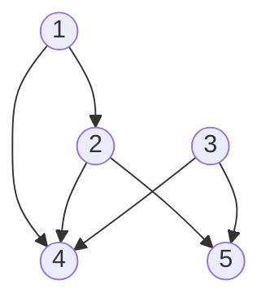

# 3.5 有向グラフの連結性

これまで考察した無向グラフの概念がどれほど有向グラフに一般化できるかを考える.  
有向グラフでは, 辺 $(u, v)$ は $u$ から $v$ への向きを持つ. このように $u$ と $v$ の関係は非対称的であり, 得られるグラフ構造には大きな影響が生じる.  
有向グラフの例として, World Wide Web がある. ページをノード, ハイパーリンクを辺と見る. ハイパーリンクは"逆行"できないため, 有向である.  
有向グラフに対しても基本的な定義やアルゴリズムが与えられている. その中には,

- 隣接リスト表現
- BFS
- DFS

などのグラフ探索アルゴリズムも含まれる.

## 有向グラフの表現

有向グラフの表現には, 隣接リストを用いる. 各点に対して二つの付随するリストを考える. その点の

- 出ていく辺の終点リスト
- 入ってる辺の始点リスト

である. 点 $u$ から有向辺をたどって到達できる点と, 逆向きに有向辺をたどって到達できる点がすぐに読み出せる.

有向グラフとその隣接リストの例:

| 点  |   始点    |   終点   |
| :-: | :-------: | :------: |
|  1  |   $[]$    | $[2, 4]$ |
|  2  |   $[1]$   | $[4, 5]$ |
|  3  |   $[]$    | $[4, 5]$ |
|  4  | [1, 2, 3] |   $[]$   |
|  5  | $[2, 3]$  |   $[]$   |

## グラフ探索アルゴリズム

有向グラフに対する BFS と DFS は, 無向グラフに対するそれらと同様である. 計算時間は $\mathrm{O}(m + n)$ .  
有向 BFS で計算されるのは, $s$ からのパスが存在する点 $t$ の集合.  
DFS についても同様. 点 $u$ から出る辺の終点に対して, 順番に, 再帰的に探索を行う.  
与えられた点 $s$ に対して, $s$ からパスで到達可能な点の集合ではなく, $s$ にパスで到達可能な点の集合を求める場合もある. そのときは, グラフ $G$ の有向グラフの向きを逆にした有向グラフ $G^{rev}$ を定義して, $G^{rev}$ で BFS あるいは DFS を走らせればよい. 任意の点に対して, $G^{rev}$ で $s$ からのパスがあることと, $G$ で $s$ へのパスがあることは等価である.

## 強連結性

### _Def_ (強連結性)

> 有向グラフが強連結(strongly connect)であるとは, 任意の 2 点 $u, v$ についても, $u$ から $v$ へのパスと $v$ から $u$ へのパスが存在すること.

### _Def_ (相互到達可能)

> 有向グラフの 2 点 $u, v$ に対して, $u$ から $v$ へのパスと $v$ から $u$ へのパスが存在する時, 2 点 $u, v$ は相互到達可能(mutually reachable)という.

つまり, 強連結性は任意の 2 点が相互到達可能であると言い換えられる.  
以下の単純な事実に基づく相互到達可能性の良い性質が存在する.

### _Prop_ (3.16)

> $u$ と $v$ が相互到達可能であり, かつ $v$ と $w$ が相互到達可能ならば, $u$ と $w$ も相互到達可能である.

#### _proof_

> $u$ から $w$ へのパスは, $u$ から $v$ まで行き, $v$ から $w$ まで行けばよい. 逆も同様.

(3.16)に基づいて, 強連結性を調べる線形時間アルゴリズムが存在する. $G$ の任意の点 $s$ について, $G$ と $G^{rev}$ を BFS を走らせる. ともに全ての点が $s$ から到達可能ならば, その時に限り, $G$ は強連結. 任意の 2 点 $u$ , $v$ はともに $s$ と相互到達可能であるため, $u$ と $v$ も相互到達可能である.

### _Def_ (強連結成分)

> 有向グラフの点 $s$ を含む強連結成分(strong component)を $s$ と相互到達可能である点の集合で定める.

上のアルゴリズムは, 実際には $s$ の強連結成分を計算していることがわかる. $G$ と $G^{rev}$ について BFS を走らせたとき, 両方に含まれる点の集合が, $s$ の強連結成分と一致する.

### _Thm_ (3.17)

> 有向グラフの任意の 2 点 $s$ と $t$ に対して, それらを含む強連結成分は同一であるか, あるいは, 互いに素である.

#### _proof_

> $s$ と $t$ を含む強連結成分をそれぞれ, $S$ , $T$ とする.  
> $s$ と $t$ が相互到達可能ならば, $^\forall{u} \in S$ , $^\forall{v} \in T$ は相互到達可能であるため, $S = T$ が言える.  
> 逆に, $s$ と $t$ が相互到達可能でないならば, $^\forall{u} \in S$ , $^\forall{v} \in T$ は相互到達可能でないため, $S$ と $T$ は互いに素が言える.

全ての点の強連結成分を, $\mathrm{O}(n + m)$ で調べることが可能.
