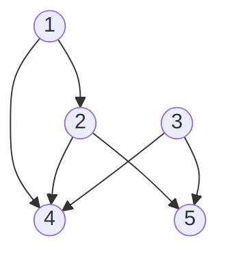

# 3.5 有向グラフの連結性

これまで考察した無向グラフの概念がどれほど有向グラフに一般化できるかを考える.  
有向グラフ $(u, v)$ は $u$ から $v$ への向きを持つ. このように $u$ と $v$ の関係は非対称的であり, 得られるグラフ構造には大きな影響が生じる.  
有向グラフの例として, World Wide Web がある. ページをノード, ハイパーリンクを辺と見る. ハイパーリンクは"逆行"できないため, 有向である.  
有向グラフに対しても基本的な定義やアルゴリズムが与えられている. その中には,

- 隣接リスト表現
- BFS
- DFS

などのグラフ探索アルゴリズムも含まれる.

## 有向グラフの表現

有向グラフの表現には, 隣接リストを用いる. 各点に対して二つの付随するリストを考える. その点の

- 出ていく辺の終点リスト
- 入ってる辺の始点リスト

である. 点 $u$ から有向辺をたどって到達できる点と, 逆向きに有向辺をたどって到達できる点がすぐに読み出せる.

有向グラフとその隣接リストの例:

| 点  |   始点    |   終点   |
| :-: | :-------: | :------: |
|  1  |   $[]$    | $[2, 4]$ |
|  2  |   $[1]$   | $[4, 5]$ |
|  3  |   $[]$    | $[4, 5]$ |
|  4  | [1, 2, 3] |   $[]$   |
|  5  | $[2, 3]$  |   $[]$   |

## グラフ探索アルゴリズム

有向グラフに対する BFS と DFS は, 無向グラフに対するそれらと同様である. 計算時間は $\mathrm{O}(m + n)$ .  
有向 BFS で計算されるのは, $s$ からのパスが存在する点 $t$ の集合.  
DFS についても同様. 点 $u$ から出る辺の終点に対して, 順番に, 再帰的に探索を行う.  
与えられた点 $s$ に対して, $s$ からパスで到達可能な点の集合ではなく, $s$ にパスで到達可能な点の集合を求める場合もある. そのときは, グラフ $G$ の有向グラフの向きを逆にした有向グラフ $G^{rev}$ を定義して, $G^{rev}$ で BFS あるいは DFS を走らせればよい. 任意の点に対して, $G^{rev}$ で $s$ からのパスがあることと, $G$ で $s$ へのパスがあることは等価である.
