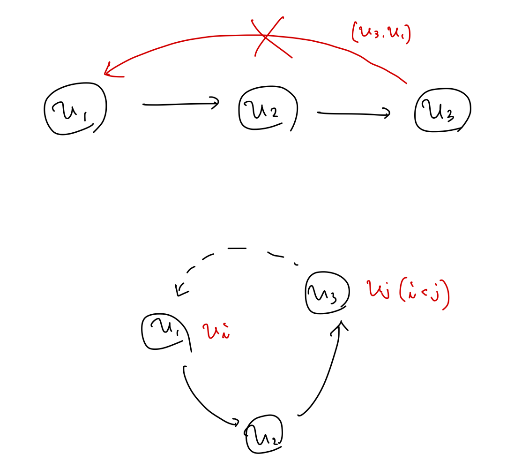
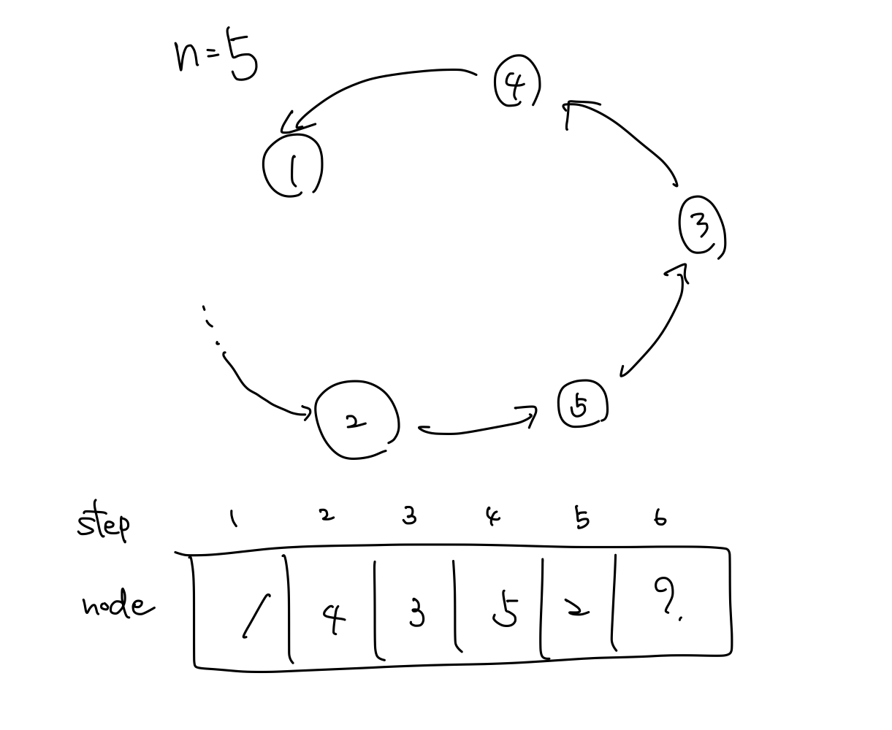

# 3.6 有効無閉路グラフとトポロジカル順序付け

無向グラフが閉路を持たないとき、どの連結成分も木になる。これに対し有向グラフでは、有向閉路を持たなくても、極めて豊富な構造を有する。

有向グラフが有向閉路を持たないとき、**有向無閉路グラフ**（directed acyclic graph）あるいは省略して、**DAG**という。

## 問題 3.2 トポロジカル順序付け

DAGは**先行関係**あるいは**従属性**を自然な方法で表現できることから、情報科学の分野では極めてよく現れる構造である。例えば、

- 先行履修条件（ある科目は他のいくつかの科目よりも先に履修しておかねばならない）
- ジョブ（ジョブiの計算結果がジョブjの入力を決定するのに用いられる）

このような互いに従属関係のあるタスクの集合は、各タスクに対して点を対応させ、jよりも前にiを処理しなければならないときに有向辺(i,j)を考えて得られる有向グラフで表現できる。

これらの先行条件を意味あるものにするためには、得られたグラフがDAGであることが必要である。実際、有向閉路Cを含んでしまっていたら、Cのタスクを正しく処理する方法はない。それは、Cのどのタスクもある他のタスクもある他の一つのジョブを終了してからでないと処理に取りかかれないからである。つまり、Cのどのタスクも最初に取りかかることができないため、いずれも処理できないということである。

DAGが得られたとして、これらのタスクを処理する順番を知りたいと考えるのは自然な発想である。すべての従属関係が満たされる、すなわち、すべての辺(v_i,v_j)で、i&lt;jとなるように点に v_1,v_2,...,v_nと順番付けすることをGの**トポロジカル順序付け**、あるいはトポロジカルソートという。言い換えると、すべての辺がこの順番で順方向に向いているということである。

Gのトポロジカル順序付は、Gが有向閉路を持たないことの直接的な証明になることが以下から分かる。

### (3.18) Gがトポロジカル順序付けできるならば、GはDAGである

**証明．** 背理法で示す。Gがv_1,v_2,...,v_nとトポロジカル順序付けされているにもかかわらず、有向閉路Cをもつと仮定する。Cの添字が最も小さい点をv_iとする。v_jをCでv_iの前にくる点とする。すなわち、(v_j,v_i)はCの辺であるとする。iの選び方より、j>iであるが、これはv_1,v_2,...,v_nがトポロジカル順序付けであるという仮定に反する。



**トポロジカル順序付けの計算．** (3.18) の逆には興味がある。つまり、DAGは必ずトポロジカル順序を持つのか、実際そのような順序付けを効率的に求めるにはどうしたらよいかを考える。

## アルゴリズム 3.2 トポロジカルソート

(3.18) の逆の証明におけるキーポイントは、入次数が0の頂点である。この頂点がなければ、そもそもトポロジカル順序は存在し得ない。よってまずは、この点の存在を示す。

### (3.19) DAG Gには入ってくる辺のない点vが存在する

**証明．** DAG Gのどの点でも入ってくる辺が少なくとも１本あると仮定する。Gの頂点uを１つ選び、少なくとも１つは存在するuに入る辺を逆向きに辿って、他の頂点に移動する。他の頂点でも自身に入る辺が少なくとも１つ存在するため、その辺を逆向きに辿って、他の頂点に移動する。この操作をn+1回繰り返す。ここでGの点数をnとすると、鳩の巣原理により、少なくとも２回同一の頂点を通る。有向閉路の存在により、仮定の無閉路性が否定された。よって、DAG Gには入ってくる辺のない点vが存在する。



### (3.20) GがDAGならば、Gはトポロジカル順序付けをもつ

**証明．** まず(3.19)でされた入次数0の頂点vを見つけ、トポロジカル順序の先頭にもってくる。次に、グラフから頂点vと頂点vに接続する辺を削除する。この操作はGの無閉路性に影響を与えないため（vの入次数が0であることは重要ではなく、そもそも辺の削除では閉路は出来得ないことに注意したい）、この操作によって得られるグラフG'もDAGである。よって(3.19)によりG'にも入次数0の頂点v'が存在し、トポロジカル順序の先頭にもってくることができる。この操作をグラフの頂点がなくなるまで繰り返す。最後に各ステップで得られたトポロジカル順序の先頭を繋げることで、Gのトポロジカル順序が得られる。

(3.20)は実際にトポロジカル順序を求めるアルゴリズムを与える。

```py
# get topological order (topological sort) O(n^2)

n: int
m: int
graph: list[set[int]]  # adjacency-list

removed: set[int] = set()

topological_order: list[int] = []

for _ in range(n):
    # search node whose indegree is 0
    for v in range(n):
        if v in removed:
            continue
        if len(graph[v]) == 0:
            break

    # remove v and related edges
    for w in range(n):
        graph[w].remove(v)

    topological_order.append(v)
    removed.add(v)

```

アルゴリズムはnステップであり、各ステップでは入次数0の頂点の発見にO(n)、辺の削除にO(n)かかることから、アルゴリズム全体でO(n^2)時間かかる。実際にグラフが密であるときにはこの上界で十分であるが、グラフが疎である場合はもっと良いものがほしい。

入次数が0の頂点の探索にはO(n)がかかるが、この部分を効率的に行うことで全体計算量O(n+m)を達成できる。具体的には、アルゴリズムでまだ除去さていない点を活性な点と呼ぶことにして、以下の2つを管理する。

1. 各点wに対して活性な点からwに入ってくる辺の本数
2. Gの他の活性な点から入ってくる辺のないすべての活性な点の集合S

最初は全ての点が活性であり、点と辺を一度走査することで1.2.は初期化出来る。各反復では、集合Sから任意の点を1点vを選んで除去することからなる。vの除去後、vを始点とするすべての辺の活性な終点wに対して、wにおいて管理している活性な点からwに入ってくる辺の本数を1減ずる。この結果、活性な点からwに入ってくる辺の本数が0になったときは、wを集合Sに加える。いずれも各辺、各点ごとに定数時間で更新できるので、アルゴリズムの全体の計算時間はO(m+n)である。

```py
# get topological order (topological sort) O(n+m)

n: int
m: int
graph: list[list[int]]  # adjacency-list

indegree: list[int] = [0] * n
s: set[int] = set()

topological_order: list[int] = []

for _ in range(n):
    v = s.pop()
    for w in graph[v]:
        indegree[w] -= 1
        if indegree[w] == 0:
            s.add(w)
    topological_order.append(v)

```
