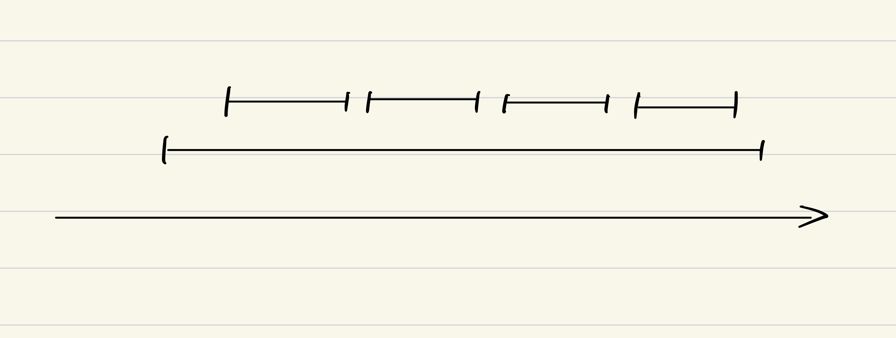
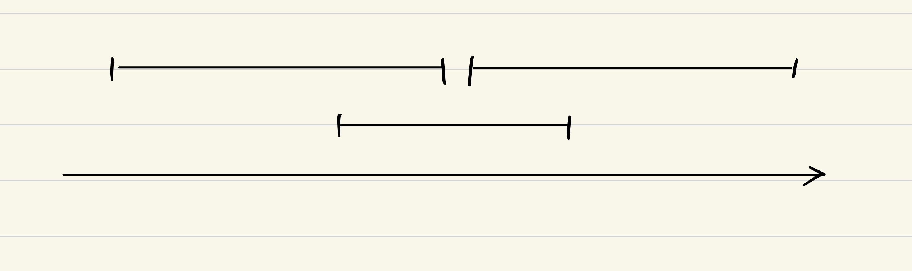
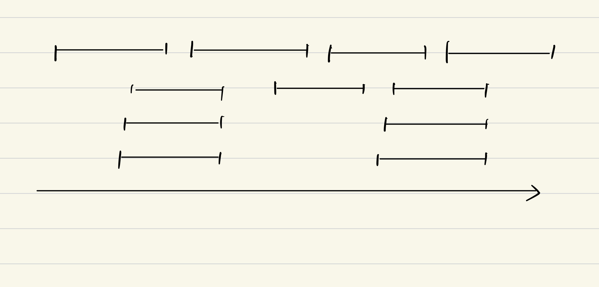
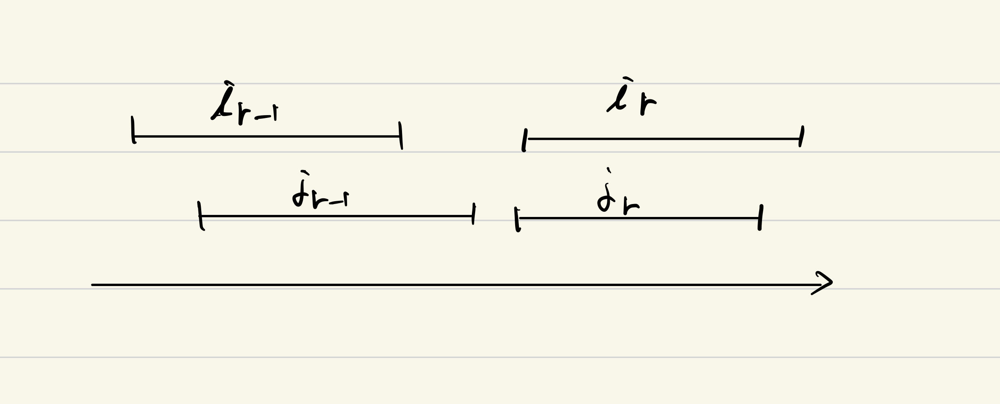

# 4 章　グリーディアルゴリズム

## Introduction

一般に, **グリーディアルゴリズム**(greedy algorithm)の定義は難しい. ある基準に基づいて, 各ステップで近視眼的に最適化する判断を繰り返して解を作り上げていくアルゴリズムはグリーディ(貪欲)であると考えられる.  
グリーディアルゴリズムで最適解が得られる問題に対して, その最適性を証明するための次の二つの基本的な方法を説明する.

- アルゴリズムの先進性(greedy algorithm stays ahead) - 任意のステップにおいて, 任意のアルゴリズムより優れていることを示す
- 交換議論(exchange argument) - 可能解を悪くすることなく交換していく方法

二つの解析法を学んだ後, 次のような様々な問題を取り上げる.

- 最短パス問題(Shortest Path Problem)
- 最小全点木問題(Minimum Spanning Tree Problem)
- Huffman 符号の構成
- クラスタリング(clustering)
- 最小コスト有向木問題

## 4.1 区間スケジュール問題

区間スケジューリング問題を思い出す.

要求の集合 $\{1,2,\dots,n\}$ に対して, 開始時刻 $s(i)$ と終了時刻 $f(i)$ が与えられる. 部分集合は, どの二つの要素も時間がかち合わないとき, 共存可能(compatible)という. 共存可能な部分集合のうち最大のものを求めたい. また, この集合を, 最適である(optimal)と呼ぶ.

### アルゴリズム 4.1 区間スケジューリング問題に対するグリーディアルゴリズム(Greedy Interval Scheduling Algorithm)

区間スケジューリング問題に対する簡単なグリーディアルゴリズムのアイデアは以下の通りである.

1. 単純な規則を用いて最初の要求 $i_1$ を決定
1. $i_1$ と共存可能でない要求を排除
1. $i_1$ と共存可能な要求の中から単純な規則に基づいて $i_2$ を選ぶ
1. 共存可能な要求がなくなるまで以下繰り返し

どのような単純な規則を選ぶのかが重要. 自然ではあるが、良い解を与えないものも多く存在する.

最も自然と思われる規則をいくつか考察する.

1. 受け入れ可能な要求のうち, 開始時刻の最も早いものを選ぶ
1. 処理時間が最小になるもの
1. 共存不可能な要求が最小のものを選ぶ

それぞれについて詳しく考える.

1. 受け入れ可能な要求のうち, 開始時刻の最も早いものを選ぶ

この方法では最適解は得られない. 一つの要求が多くの時間を占めることになる可能性があり, 共存可能な部分集合のサイズを最も大きくするという目的には不適切.

2. 処理時間が最小になるもの

すなわち, $f(i) - s(i)$ が最小になるものを選ぶ. これも最適解は得られない. ある最適な区間の間にある区間を含めてしまうような場合がある.

3. 共存不可能な要求が最小のものを選ぶ

1 と 2 の規則の問題点は, それぞれの要求がかち合うことで, 要求を拒否せざるを得ないことにある. そこで, 排除すべき要求の数が最小のものを選んでいく. この方法はかなりよく思われるが, 最適解は得られない.

最適解が得られるグリーディ規則は, 終了時刻の最も早い要求を選ぶことである. すなわち, $f(i)$ が最小となるような要求を選ぶ.  
形式的なアルゴリズムは以下.

> 最適な共存可能集合 $A$ を考えるグリーディアルゴリズム:
>
> > $R$ を全ての要求の集合とし, $A$ を空集合とする  
> > **While** $R$ が空でない  
> > &nbsp; &nbsp; 終了時刻が最小の要求 $i \in R$ を一つ選ぶ  
> > &nbsp; &nbsp; 要求 $i$ を $A$ に追加する  
> > &nbsp; &nbsp; 要求 $i$ とかち合うすべての要求を $R$ から削除する  
> > **Endwhile**  
> > 受け入れた要求の集合として $A$ を返す

### アルゴリズムの解析

このグリーディアルゴリズムは自然であるが, 自明ではない.  
共存可能性はすぐに得られる.

### _Fact_(4.1)

> $A$ は共存可能な要求な集合

#### _proof_

> アルゴリズムより明らか. $\blacksquare$

従って, $A$ が最適であることを示せばよい. ある最適な区間の集合を $\mathcal{O}$ として, $|A| = |\mathcal	{O}|$ を示す.  
最初に示したように, 各時点で $A$ が $\mathcal{O}$ に先進していることを示す.  
いくつかの記法を導入する. $i_1, \dots, i_k \in A$ として, 添字の順で $A$ に加えられたものとする. ここで, $|A| = k$ とする. 同様に, $j_1, \dots, j_m \in \mathcal{O}$ とする. $k=m$ を示せば良い. $j_i$ は左から並んでいるものとする.

**Rem**: $\mathcal{O}$ は共存可能な要求の部分集合であることから, 開始時刻の順と終了時刻の順は同じ

グリーディアルゴリズムは, 終了時刻の最も早いものを選ぶため, $f(i_1) \le f(j_1)$ が言える. より一般に, $f(i_r) \le f(j_r)(r=1,\dots,k)$ が得られる. これは, "先進している"ことを意味する.

**Rem**: 少なくとも $k \le m$

実際に命題として与える.

### _Prop_(4.2)

> すべての添え字 $r \le k$ に対して $f(i_r) \le f(j_r)$ である.

#### _proof_

> induction で示す.  
> $r = 1$ の時は明らか.  
> $r>1$ について, $f(i_{r-1}) \le f(j_{r-1})$ と仮定する.  
> すると, $\mathcal{O}$ の要素の添え字の規則から , $f(i_{r-1}) \le f(j_{r-1}) < s(j_r) $ であるため, $i_{r-1}$ と $j_r$ は共存可能. 帰納的に $^\forall{l} = 1,\dots,r-1$ について, $i_l$ と $j_r$ は共存可能. $f(i_r) > f(j_r)$ と仮定すると, $f(i_r)$ の最小性に矛盾(図 4.3 参照). よって, $r$ についても成立.  
> 従って, 任意の $r$ について命題は成立. $\blacksquare$

図(4.3)

グリーディアルゴリズムが最適解 $\mathcal{O}$ より先進することは示された. 次に, アルゴリズムが最適な集合 $A$ を返すことを確かめる.

### _Prop_(4.3)

> グリーディアルゴリズムは最適な集合 $A$ を返す.

#### _proof_

> $A$ が最適でないとする. ある最適な集合 $\mathcal{O}$ が存在する. $|A| = k, |\mathcal{O}| = m$ とすると, $m > k$ が言える. $r = k$ について, 命題 4.2 を適用すると, $f(i_k) \le f(j_k)$ が得られる. ここで, $\mathcal{O}$ には $j_{k+1}$ が含まれる. これは, 命題 4.2 の証明と同様に, $A$ の任意の要求と共存可能から $R$ に含まれる. しかし, $|A| = k$ より, この段階でアルゴリズムが終了しているため, $R$ は空でなくてはならない. 矛盾.  
> 従って, 題意は示された. $\blacksquare$

### 実装とアルゴリズム

この要求を, 終了時間について sort することで $\mathrm{O}(n\log{n})$ で解ける.

### 問題 4.1 区間分割(Interval Partitioning): 問題の背景と定式化

区間スケジューリング問題では, 一つの資源に対して, 利用時間帯が付随した要求が与えられた. それに対して, **区間分割問題**(Interval Partitioning Problem)は, 同等ないくつかの資源に対して, できるだけ少ない資源を用いてすべての要求をスケジュールする問題である.  
例えば, すでに決まっている時間割に対して, 教室を割り当てるような問題である. 教室は資源で, 講義が要求となる. 使用する教室をできるだけ少なくするにはどうすれば良いかを考える.

### _Def_ (深さ(depth))

> 区間の集合の深さ(depth)を時間軸上の任意の 1 点を含む区間の個数の最大値と定義する.

### _Prop_(4.4)

> 区間分割問題の任意のインスタンスにおいて, 少なくとも区間の集合の深さと同じだけの資源が必要になる.

#### _proof_

> 深さ $d$ の区間の集合を考える. 時間軸上の共通の点を含む区間を $I_1,\dots, I_d$ とする. これらの区間はいずれも異なる資源上でスケジュールしなければならない. 従って, インスタンス全体を考えても, 少なくとも $d$ 個の資源が必要である. $\blacksquare$

ここで, 二つの問題を考える.

- すべての区間を必要最小限の資源でスケジュールする効率的なアルゴリズムは存在するか
- 深さと等しい個数の資源を用いるスケジュールが常に存在するか

二つ目の問題に肯定的な回答ができれば, 区間を分割するための障害は, 純粋に局所的なものとなり,　同じ点を共有する区間の集合でしかないことになる.  
以下では, 深さと同じ個数の資源を用いて全ての区間をスケジュールするグリーディアルゴリズムを与える. これは, 命題 4.4 より最適解を与えることになる.

### アルゴリズム 4.2 区間分割アルゴリズム(Interval Partitioning Algorithm)

$d$ を区間集合の深さとする. 各区間にラベル $\{1,2,\dots,d\}$ を割り当てることを考える.

> $I_1, I_2,\dots,I_n$ へのラベル $\{1,2,\dots,d\}$ の割り当てアルゴリズム:
>
> > 区間を開始時刻でソートする  
> > **For** $j = 1,2,3,\dots,n$  
> > &nbsp; &nbsp; $I_j$ に対するラベルの候補を $\{1,2,\dots,d\}$ とする  
> > &nbsp; &nbsp; **For** このソート順において $I_j$ より前にあり, かつ $I_j$ とかち合うすべての区間 $I_i$  
> > &nbsp; &nbsp; &nbsp; $I_i$ のラベルを $I_j$ に対する候補から除外する  
> > &nbsp; &nbsp; **Endfor**  
> > &nbsp; &nbsp; **If** $I_j$ に対する候補から除外されていないラベルが $\{1,2,\dots,d\}$ の中にある **then**  
> > &nbsp; &nbsp; &nbsp; 候補になっているラベルの一つを任意に $I_j$ に割り当てる  
> > &nbsp; &nbsp; **Else**  
> > &nbsp; &nbsp; &nbsp; $I_j$ はラベル付けされていないままとする  
> > &nbsp; &nbsp; **Endif**  
> > **Endfor**

### アルゴリズムの解析

上記のアルゴリズムに対して以下の命題が成立

### _Prop_(4.5)

> 上記のアルゴリズムを用いると, どの区間もラベルが割り当てられ, しかも, 互いにかち合うどの二つの区間も同じラベルが割り当てられることはない.

#### _proof_

> まず, すべての区間にラベルが割り当てられることを示す.　一つの区間 $I_j$ を考える. ソート後の順序で $I_j$ より前にある, $I_j$ とかち合う区間は $t$ 個であるとする. これら $t$ 個も区間と, $I_j$ を含めた $t+1$ 個の区間は, $I_j$ の開始時刻を共通して含む. ここで, $t+1 \le d$ , すなわち $t \le d -1$ . 従って,　これら $t$ 個の区間に割り当てられなかったものが少なくとも 1 つは存在する. これを $I_j$ のラベルとすればよい.  
> 次に, かち合う二つの区間が, 同じラベルを割り当てられないことを示す. これはアルゴリズムより自明. $\blacksquare$

まとめると, 以下の命題が成り立つ.

### _Prop_(4.6)

> 上記のアルゴリズムは, 区間集合の深さに等しい個数の資源を用いて, すべての区間をスケジュールする. したがって, この深さは, 必要な資源に対する最適な個数となる.

#### _proof_

> (略)
