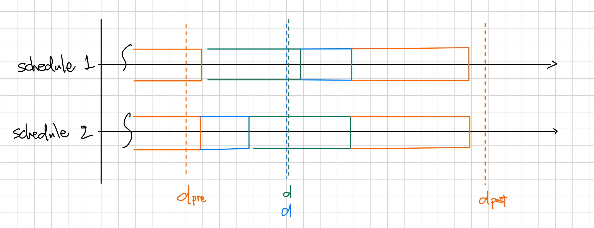

# 4.2 遅延最小化スケジューリング：交換議論

## review

最適性の示し方

- アルゴリズムの先進性(greedy algorithm stays ahead) - 任意のステップにおいて, 任意のアルゴリズムより優れていることを示す
- **交換議論(exchange argument) - 可能解を悪くすることなく交換していく方法** (←今回)

## 問題 4.2 遅延最小化スケジューリング

### 問題設定

- 単一の資源と、その資源をある時間だけ利用したいという $n$ 個の要求がある
- 資源は時刻 $s$ から利用可能
- 要求 $i$ は期限 $d_i$ をもつ
- 要求 $i$ は長さ $t_i$ の連続する時間だけ資源を利用する
- 受け入れた異なる要求には互いにかち合わない時間を割り当てる

### 入力（定数）

- $n$ - 要求の個数
- $s$ - 資源が利用可能となる時刻
- $d_i$ - 要求 $i$ の期限
- $t_i$ - 要求 $i$ が連続的に資源を専有する時間

### 変数

- $s(i)$ - 各要求 $i$ に対する開始時刻
  - （開始時刻を決定すると、終了時刻 $f(i)=s(i)+t_i$ も同時に決まる）

### 制約

- 任意の $i,j$ に対して、$(s(i),f(i)) \cap (s(j),f(j)) =\empty$

### 目的関数

- 決定された各要求の開始時刻 $s(i)$ に対して遅延 $l_i=\min{(f(i)-d_i, 0)}$ を定義する
  - $l_i>0$ のとき、要求 $i$ は遅れているという
- 最大遅延 $L=\max_{i}{l_i}$ を最小化する

## アルゴリズム 4.3 最大遅延最小化スケジューリングアルゴリズム

以下、要求を「ジョブ」と呼ぶ。

ジョブに関するデータの観察から、以下の自然なアルゴリズムを思いつく。

1. 専有時間 $t_i$ が小さい順番に処理する
    - 以下のインスタンスで最適解を得られない。ジョブ2の専有時間が多いものの、締切がジョブ1に比べ圧倒的に短いため遅延が発生してしまう
    
2. 猶予時間 $d_i-t_i$ が小さい順に処理する
    - 1.の結果から猶予時間に基づいて、スケジューリングを行うが、残念ながらこれも上手く行かないインスタンスが存在する
　  

---

### 最近期限優先アルゴリズム

以下のアルゴリズムは常に最大遅延が最小となる最適解を与える。

- ジョブの期限 $d_i$ の短い順で処理する（最近期限優先）
- 直感的には、期限が早いジョブは早く終わらせなければならない
- 入力の半分 $t_i$ を捨てているという理由で懐疑的

> 最近期限アルゴリズム：  
> ジョブを期限の早い順にソートする  
> 基本を簡単化して $d_1\le\cdots\le d_n$ と仮定する  
> $f=s$ と初期化する  
> **For** $i=1,\ldots,n$  
> $\space$ ジョブ $i$ に帰国 $s(i)=f$ から $f(i)=f+t_i$ までの区間を割り当てる  
> $\space$ $f=f+t_i$ とする  
> **Endfor**  
> 各ジョブ $i=1,\ldots,n$ に対してスケジュールした区間 $[s(i),f(i)]$ の集合を返す

### アルゴリズムの解析

メモ：最適性の証明の流れは以下の通りである。

0. アイドル時間と反転を定義する
1. 反転もアイドル時間をもたない最適スケジュールの存在を示す → (4.7, 4.9)
2. 反転とアイドル時間をもたないスケジュールの最大遅延はいずれも同じであることを示す → (4.8)
3. （アイドル時間と反転を持たない）上記アルゴリズムが出力するスケジュールは、1.で存在を示した最適スケジュールと同じ最大遅延をもつことになり(2.)、結果としてアルゴリズムのスケジュールの最適性が示される → (4.10)

---

一般に、機械のジョブ処理において、ギャップという言葉がある。

- ギャップ - 連続する二つのジョブにおいて、前のジョブが終わって後続のジョブが始まるまでの機械が稼働していない時間が 0 でないこと
  - しなければならない作業があるにもかかわらず、何らかの理由で機械が遊んでいる時間
- アイドル時間 - ギャップの時間

上述のアルゴリズムが出力するスケジュールには、ギャップは存在しない。このことに注意して、アルゴリズムの最適性を論じる。

### (4.7) アイドル時間のない最適スケジュールが存在する

**証明．** アイドル時間のある最適スケジュールが存在したとして、そのギャップを埋めたとしても後続するジョブの遅延が少なくとも増加することはない。つまり、任意のアイドル時間のある最適スケジュールは、アイドル時間のない最適スケジュールに変換することが可能である。

---

最適なスケジュール $\mathcal{O}$ を、最適であることを維持したまま $\mathcal{O}$ を徐々に変更することで、アルゴリズムが出力したスケジュール $\mathcal{A}$ と等価なスケジュールにすることを考える。（これを**交換議論**という）

まず、スケジュールに対して、以下のような特徴付けを考える。

- **反転** - 期限 $d_i$ をもつジョブ $i$ が、より期限の早い、すなわち $d_j<d_i$ であるようなジョブ $j$ より先にスケジュールされていること

最近期限優先アルゴリズムでは、期限順にジョブを処理するのだから、出力されるスケジュールに反転は存在し得ないことに注意する。期限の同じジョブが複数あれば、反転が存在しない異なるスケジュールは複数存在し得るが、これらのスケジュールは全て同じ最大遅延 $L$ を持つことを示す。

### (4.8) 反転をもたず、アイドル時間ももたないスケジュールは、いずれも同じ最大遅延をもつ

**証明．** 二つの反転とアイドル時間を持たない異なるスケジュールを考える。今、二つのスケジュールで異なるのは、同じ期限を持つジョブのスケジュール順序のみである。（同じ期限を持つジョブ群の前後は、より早い期限を持つジョブと、より遅い期限を持つジョブがスケジュールされている）

期限 $d$ をもつジョブの間では、最後のジョブが最大遅延を持つことになり、したがってこの遅延はジョブの順序には依存しないことになる。

まとめると、反転とアイドル時間を持たないスケジュールは、同じ期限を持つジョブ群のスケジュール順序のみが異なるが、それらの順序の違いは最大遅延に影響を与えないことが示された。

（忘れそうになるが、本問題の目的は、遅延の合計ではなく、最も大きな遅延を最小化することであることに注意しよう）

---

反転もアイドル時間もない最適スケジュールの存在を示すことが、上記アルゴリズムの最適性の証明における中心ステップとなる。

流れは次のとおりである。

1. アイドル時間をもたない任意の最適スケジュールを考える
2. 最大遅延を増やすことなく、このスケジュールを反転をもたないスケジュールに変換する
3. 変換の結果得られるスケジュールもまた最適である

### (4.9) 反転もアイドル時間ももたない最適スケジュールが存在する

**証明．** 命題(4.7)からアイドル時間のない最適スケジュールの存在は既に示された。証明はいくつかの命題から成り立っている。

#### (a) $\mathcal{O}$ が反転をもつならば、ジョブの対 $i,j$ で、 $j$ が $i$ の直後にスケジュールされ、かつ $d_j<d_i$ であるものが存在する

仮定より、$\mathcal{O}$ にてジョブ $a$ がジョブ $b$ より前にスケジュールされていて、かつ $d_a>d_j$ であるものが存在するとする。そこで、$a$ から $b$ までスケジュールされた順に、1個ずつジョブを見ていくと、その次のジョブの期限が始めて減少するところが存在することになる。これが、反転を形成する連続するジョブの対 $i,j$ に対応する。

#### (b) $i$ と $j$ を入れ替えた後で得られるスケジュールは反転が一つだけ少ない

(a) より、$i,j$ は連続していると仮定できるので、これらを反転させても、他のジョブには影響を与えることはなく、反転が一つ消滅することになる。

#### (c) 入れ替えて得られたスケジュールの最大遅延は、 $\mathcal{O}$ より大きくはならない

(c) の証明のために、新たな記法をいくつか導入する。

スケジュール $\mathcal{O}$ において、各ジョブ $r$ は時間 $[s(r),f(r)]$ にスケジュールされ、遅延 $l_r'$ をもつとする。すると、 $L'=\max_r{l_r'}$ がこのスケジュールの最大遅延になる。入れ替えて得られるスケジュールを $\mathcal{\bar{O}}$ と書き、このスケジュールに対する $s(r),f(r),l_r',L'$ を代わりにそれぞれ $\bar{s}(r),\bar{f}(r),\bar{l}_r,\bar{L}$ と書くことにする。

二つの連続する反転したジョブ $i,j$ に着目し、$d_i>d_j$ を仮定する。この二つを入れ替えても、それより前後のジョブの開始時間や終了時間には影響を及ぼさない。加えて、入れ替えてもこれ以上 $j$ の遅延が増加することはない。

したがって、気にすべきなのはジョブ $i$ のみである。$\mathcal{O}$ におけるジョブ $i$ の遅延は $l_i'=s(i)-d_i$ 、交換後の $\mathcal{\bar{O}}$ における遅延は $\bar{l_i}=\bar{f}(i)-d_i=f(j)-d_i$ である。ここで、$d_i>d_j$ の仮定から、

$$\bar{l}_i=f(j)-d_i<f(j)-d_j=l_j'$$

となる。一方で、元のスケジュール $\mathcal{O}$ の最大遅延 $L'$ は、 $L'\ge l_j'\gt\bar{l}_i$ であり、したがって入れ替えてもスケジュールの最大遅延が増加しないことが示されたことになる。

---

最初のスケジュール $\mathcal{O}$ では、高々 $\binom{n}{2}$ 個の反転が存在し、(a) によって存在が保証される、連続してスケジュールされた反転を入れ替えると、(b) により反転は一つ消滅する。またこのとき、(c) により最大遅延を増加させない。これを高々 $\binom{n}{2}$ 回繰り返して得られたスケジュールは、反転とアイドル時間をもたない最適スケジューリングということである。

### (4.10) グリーディアルゴリズムで得られるスケジュール $\mathcal{A}$ は最適な最大遅延 $L$ をもつ

> **証明．** (4.9) により、反転もアイドル時間ももたない最適スケジュールが存在する。さらに (4.8) より、反転もアイドル時間ももたないどのスケジュールも最大遅延が同じである。したがって、グリーディアルゴリズムで得られたスケジュールは最適である。
